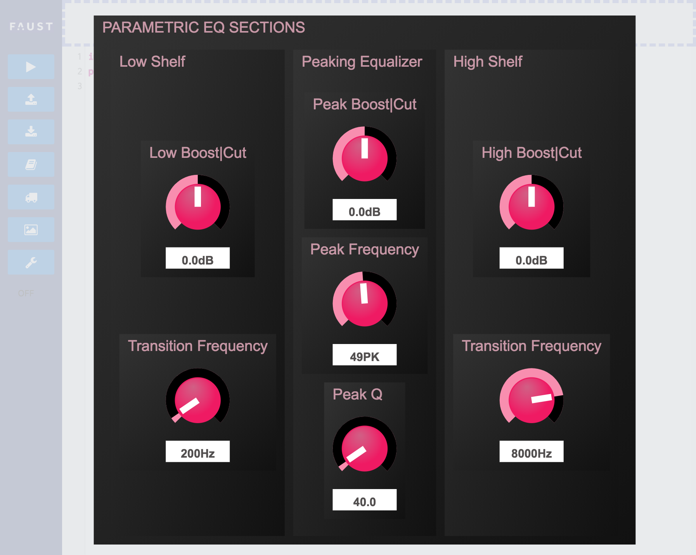
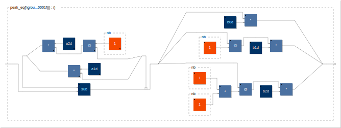
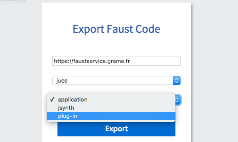
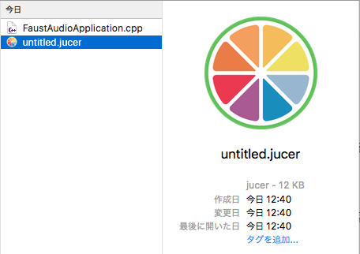
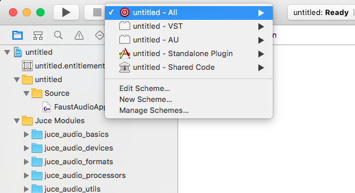
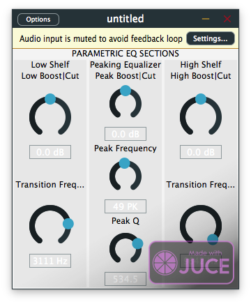
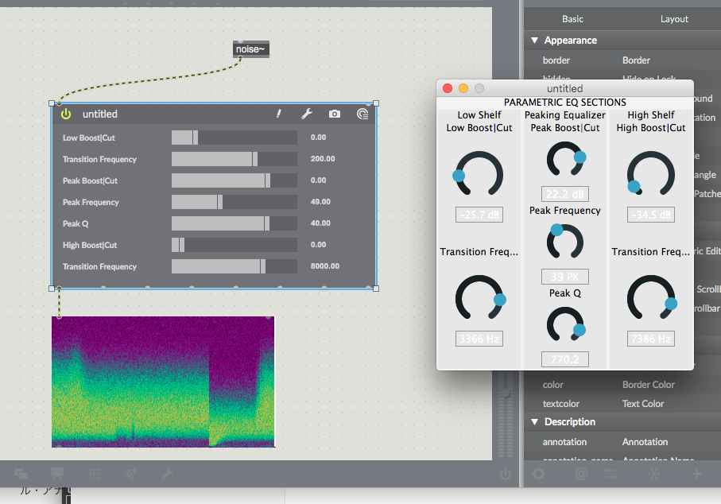

*この記事はFaust Advent Calender 2017の2日目の記事とJUCE Advent Calenderの合同記事です（手抜きと呼ばないで）。*

<https://qiita.com/advent-calendar/2017/faust>

<https://qiita.com/advent-calendar/2017/juce>


2017年、FaustもJUCEも色々アップデートが進みまして連携も取りやすくなったので、Faust&JUCEで簡単にGUIつきVSTを作るチュートリアル記事を書いていきます。

<!--more-->

# まず

## Faustとは

FaustはフランスのGrameという研究所が中心に開発している、簡潔（かつやや特殊）な記法で信号処理を記述することができるプログラミング言語で、C++を経由してスタンドアロンアプリ、VST/AU/LADSPA/Lv2プラグイン、JUCEなどの様々なアーキテクチャ、さらにはOWLやBelaなどのハードウェアプラットフォームにもと、様々なプラットフォームへエクスポートが出来る環境を備えています。
また最近ではLLVMを利用して実行時コンパイルやWebAudioなどへのエクスポートも可能です。

詳しくは[こちらのスライド](https://tomoyanonymous.github.io/faust_jp_tutorial/index.html#/)や、[この紹介記事](https://matsuuratomoya.com/blog/2016-12-01/faust_introduction)を参照下さい。

今年は初めて日本での勉強会が開かれたりするなど少しずつユーザーが増えてきています。

## JUCEとは？

JUCEとはGUIつきのオーディオアプリケーションやプラグインを作るためのフレームワーク（オープンソースだが商用ライセンスは有料）で、アドベントカレンダー1日目のCO_COさんが詳しく書いてくださってます。

<https://qiita.com/COx2/items/12a48c4a30c49732dcc5>

> ## JUCEの特徴は？
>
> JUCEの最大の特徴として、オーディオプラグインを開発するためのテンプレートが充実していることが挙げられます。VST/AudioUnit/AAX/RTASプラグインといった、DTMユーザーにはお馴染みのプラグインフォーマットを開発するのに長けており、日本国内外で多くの採用事例があります。


# Faust×JUCE、とりあえず作ってみる

Faustは文法の説明などを始めるとキリがないので、とりあえず1行もコードを書かずにVSTを作るところまでの流れを体感してみようと思います。

## ブラウザ上でコードを書く

**まずはこちらのURLにアクセスしてみましょう。**

<http://faust.grame.fr/editor/>

これはFaustのコードをリアルタイムにブラウザ上で実行、編集できるオンラインエディタです。最近出来たばっかりなのでまだ不安定な部分もありますが・・・。

オンラインエディタを始め、FaustliveなどのだいたいのFaustの開発環境は信号処理の為のFaustコードの集まりである**標準ライブラリ**が読み込めるようになっています。そしてこの中に**デモ**コードが含まれています。

<https://faust.grame.fr/libraries.html#demos.lib>

試しに、今回はよくあるイコライザーのデモ``parametric_eq_demo``というのを使ってみましょう。エディタに次のコードをコピペして下さい。

```java
import("stdfaust.lib");
process = dm.parametric_eq_demo,dm.parametric_eq_demo;
```

コードはたったこの2行です。ざっくり解説すると、

- importでライブラリファイルを呼び出すことが出来ます。
- stdfaust.libは全部のライブラリを呼び出すための親ライブラリで、demo.libの中の変数/関数をdm.hogehogeというかたちで呼び出せます。
- なのでdm.parametric_eq_demoで呼び出せるのですが、これだけだとモノラルになってしまうので二つ並列してあげるとステレオになります。

このあたりは詳しくは[文法解説](https://matsuuratomoya.com/blog/2017-01-17/faust_grammer)をお読み下さい。とりあえず左上のRUNボタンを押すとこのような画面になると思います。



もしかするとWebAudioの問題でマイクのインプットが拾えずエラーのアラートが出るかもしれませんがとりあえずは問題ありません。マイクが認識されてる場合はマイク入力がスピーカーから出ているはずです（ハウリングにお気をつけ下さい）。

ちなみに左の、下から2番めの写真のアイコン、view block diagramを押すと新しいタブでSVG画像の信号処理ダイアグラムの画面が見られます。



## JUCEプロジェクトをダウンロードする

さてではここからJUCEとの連携です。

メニュー下から3番目、トラックのアイコンのエクスポートボタンを押してみましょう。



**プラットフォーム**とその詳細が選べます。ここで各OS→VSTを選ぶといきなりVSTプラグインが落とせるのですが、残念ながら**このプラグインはGUIが出せません**。ここでは画像のようにJUCE→pluginというように選んで下さい。midi入力などが必要なシンセサイザー系はjsynthを選ぶと多分うまくいくはずです。

exportを押すとしばらくするとQRコードが出てきます。これがDLリンクなのでクリックするとZIPが落ちてきます。


ZIPを開くと、



落ちてきているのはJUCEのプロジェクトファイルとcppソースファイルです。

## JUCE側での操作

というわけでここからはJUCE側での作業です。JUCEの開発環境Projucer、およびVST SDKが入ってない人はインストールして下さい。

https://juce.com/projucer

https://www.steinberg.net/en/company/developers.html (VST SDKは私はユーザフォルダ直下に置いてます。)

このプロジェクトフォルダーを(User)/JUCE/Projectsに移動しましょう（モジュールのパスが相対なので）。

では.jucerファイルを開きます。今回見るべきなのは

1. プロジェクトセッティングのproject type
2. juceモジュールとVSTSDKのパスが通っているか

のみです。

まずプロジェクトセッティングは左上の歯車ボタン。


ここをAudioPluginにしましょう(普通は最初からなってます)。標準でAudioUnitとスタンドアロンにもチェックが入っていますのでそちらも勝手に出来上がります。

パスについてはJuceモジュールは左サイドバー、モジュールタブの右下の歯車ボタン。


後者はFile→Global Search Pathsから（前はプロジェクト単位の設定があった気がするんですが変わったみたいですね？）


で設定できます。足りない時は赤くなっているはずです（RTASとかAAX、または自分のOS以外のパスに関しては気にしなくて平気です）。

問題なければSave and Open in IDEで開きましょう。

## IDE上での操作

今回はMacでやっているのでXcodeでの説明になります。

**しかし、基本的にここではもうRunするだけでいきなりVSTが完成するはずです。**




**できました。**最高ですね。試しにスタンドアロンのアプリを開きます。



行けてますね。これもフィードバックループに気をつけつつマイク入力から試してみて下さい。

プラグインの方もMaxで試してみましょう。ホワイトノイズを突っ込んでスペクトログラムを見てみます。



いい感じですね。というわけで最も簡単にFaust&JUCEでGUI付プラグインを作る方法でした。

今回はオンラインエディタでやってましたがFaustLiveという環境でも可能ですし、ローカルにFaustコンパイラが入っていればJuceプロジェクトを出力するところも全てローカルで行えます(faust2juceというスクリプトがあります)。


# どこまでC++を書かずに行けるのか

エフェクター的な信号処理部分に関してはFaustでは

- **スペクトラルプロセッシング（マキシマイザとか、ピッチシフトとか）を使うもの**
- **特定のオーディオファイルを読み込むもの**

**以外**はだいたい作れると言っていいです。

それからGUIに関しては

- ノブ、スライダー（縦・横）
- 数値入力
- トグルボタン
- 普通のボタン
- シグナルメーター（縦・横）
- ラジオボタン

このあたりは**Faustのコード上で定義できます**。そしてレイアウトも同様にFaust上で水平、垂直、タブでのグルーピングを駆使することである程度自由度のあるレイアウトが可能です。一方で

- 上記以外のUI（XYパッドとか、JUCEには標準である2,3本まとまったスライダーとか）
- UIの個別の大きさ変更、個別の細かいレイアウトの調整

等は出来ませんのでこれ以上をやりたいときには自力でJUCE側をいじらないといけません。

問題はfaust2juceやオンラインコンパイラで自動で出力したコードはコンパイラが自動でJUCE用GUIの定義などを書いた依存ファイルを全部1ファイルの中に展開してしまっているのでこちらをベースに編集していくのは結構面倒くさいということです。

そのため最小限構成でfaust→C++にした後でJUCEプロジェクトに読み込み、JUCEUIなどのJUCE連携時に使う便利なクラスは個別にインクルードすればよいということです。

この場合でも**信号処理とそれ以外の部分の開発をコード的にも、開発ワークフロー的にもかなりきれいに切り分けられる**という大きなメリットがあるのでFaust＆JUCEの価値はかなり大きいです。

・・・ですが今回は力尽きたのでここまでということで。。。また時間が取れれば今そちらの構成を試しているところなので書きたいと思います。ありがとうございました。
