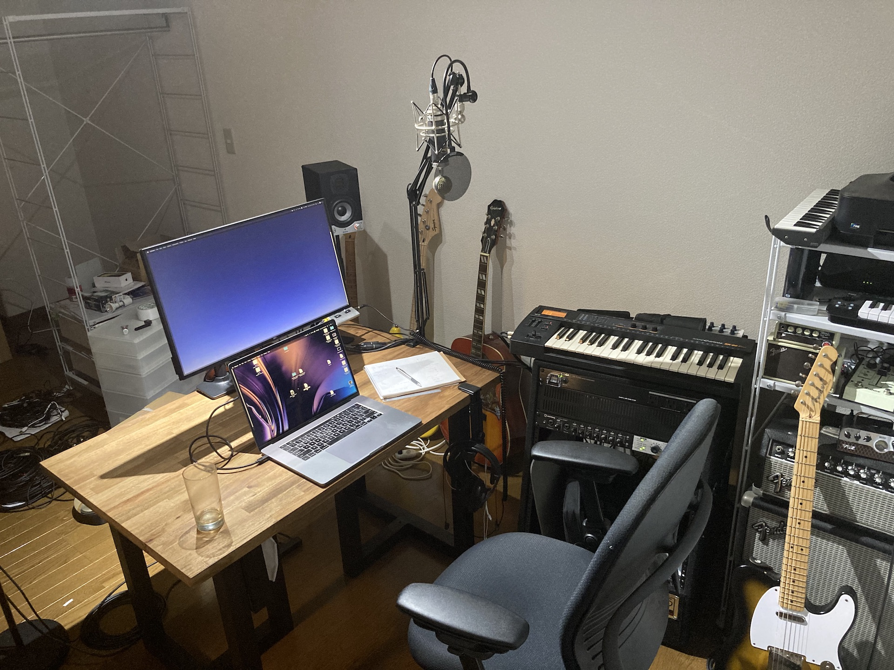

今年度前期、福岡女学院大学で「サウンド・デザイン」というタイトルの講義を持ちました。実はまだ成績評価という仕事が残っているけど、忘れないうちにまとめておこうと思ったので・・・。

そもそも初年度なので授業どうするか+サウンド・デザインという講義作り自体の難しさ+コロナ対応の三種類の話が全部突っ込まれた内容なので、あんまり誰の参考にもならない気がする。

講義資料(スライド及音声講義(Google Meetの録画除く))はすべて

**https://teach.matsuuratomoya.com/docs/2020/fukujo-sounddesign**

で公開してます。

# 計画段階 

去年の秋ぐらいからお誘い頂いており、授業の内容はほぼ自由に決めてもらって構わないとのことだったので、ぼんやりどんな授業にしたものかなあと考えていました。

「サウンド・デザイン」という授業名だけは決まっていたので、「サウンド・アート」でもなく「サウンド・プログラミング」「サウンド・エンジニアリング」「サウンド・パフォーマンス」でもなく、デザインかあと思いつつ、まあ確かに学部時代にアニメの音響とか一通り実践はしてるし、商業展示のサウンドデザインとかもちょいちょい仕事でやっているし、全面的にサウンドアートの授業よりも「**(広義の)サウンドデザイン**」は教えるのに向いてるような気もする、という事で一般的にサウンド・デザインと言った時の映像音響中心な授業ではなく、音が関係してくるデザイン全般という事で、展示だったり、UIのサウンドデザインとかいろんな方向の話を取り上げる方向にする事にしました。

ていうか映像メインの「サウンド・デザイン」の授業だと[ヲノサトル先生](https://www.youtube.com/watch?v=tfR1HA-Iujk)や[岸野雄一先生](https://bigakko.jp/course_guide/art_mediation/eizouonkyo/info)の圧倒的知識量に見劣りしてしまうみたいな話もあります。

一方で受講生の背景や環境はこんな感じ。

- 大学のMacがある部屋を用いて行う（予定だった）。
- その部屋や機材の制限もあるので学生の人数は20~30人。
- 受講生は主に2,3,4年。おおよそ2:1:1ぐらいの割合。
- 学部はどちらかというと文系。自分のコンピューターを所持していない人もいる。
- LMSはちょうど今年度からGoogle Classroomが導入された。

当初から念頭においていたことは以下のようなことだった。

- **なるべく手を動かす** - とはいえ、延々レクチャーだけでも結構辛いし、何より自分の耳と手を使わんと身につかないのはわかっていたので、小さめのワークショップや課題を繰り返す感じにしたい。
- **しかし、技術のチュートリアルにしない** - これはオンラインになると尚の事だがProtoolsとかCubaseの使い方解説講座になると、ガチのYoutuberのクオリティに絶対勝てないし、ググった方が早いことになってしまう。まずググるためのボキャブラリーを増やすことを優先したい。[多摩美の詰イラレ](https://blogs.adobe.com/japan/tmb_integrated/)みたく、ツールを完全に体の一部として扱えるようになってから見えてくるものも確かにあるのだが、そもそもこの授業を受ける人はおそらく職業としてProtoolsオペレータになるような人はほとんどいないだろうこともあって、より陳腐化しない知識に焦点を絞る方向にしたい。

## 授業のデザインの参考にしたもの

松浦は講師の経験は集中講義はおろかゲスト講義とか塾講の1つもやったことがありませんでした(結果的に[6月にSFCのx-music研究会のゲスト講義](https://speakerdeck.com/tomoyanonymous/can-we-seriously-change-music)に呼ばれたりしましたが)
。TAが関の山です。そもそも接客業をやったことがない。なので授業の作り方というもの自体をまずどうするかについてもいろいろ人の資料を参考にしました。

**[Taeyoon Choi - Teaching as Art](https://tchoi8.github.io/teachingasart/lecture1.html)**

2018年に留学していた[School for Poetic Computation](http://milieu.ink/column/tomoya_nonymous)で受けていた授業。人生で唯一受けた教えることについての授業だったので多分一番影響を受けていると思う。ちょうどオファーをもらった段階で[SFPCがYCAMで10日間WSをやった時のTA](https://www.ycam.jp/events/2019/sfpc/)をやれたのも大きい体験だった。ここで学んだことがきちんと実践できたかというと微妙だが…

あとは、それよりずっと前にYCAMインターンで教育普及インターンに混じって参加したワークショップ企画の時の資料とか。多分あの時の経験がなければ90分喋るプランを立てる能力とかは全く身についてなかったと思う。

いろいろ考えた結果最初数回でスピーカーとかを自作するハードウェア系WSを数回+Puredataを使ってサウンドプログラミングの基礎をやりつつ、その一環で錯聴とかのプログラムを作って音響心理についてもかじる、みたいな講義の骨子が一応完成し、シラバスを投稿。

# 資料のオープン化

最初にも書いたけど、授業資料専用のWebサイトを早めの段階で作った。

https://teach.matsuuratomoya.com/

このWebサイトにサブセクションを作ってもよかったんだけど、そろそろコンテンツが肥大化しすぎてきて整理がつかなくなるかもしれない＋今後も数年にわたって使うかもしれないとか考えると、別建ての方が良さそうという判断。

当初から、出せる範囲でスライドとかは全部公開していこうと思っていた。リファレンスはもちろん学部時代お世話になった<https://yoppa.org/>。

あとは比嘉さんのTDの授業のやつとか<http://satoruhiga.com/TDWS2019/>。

サイトはなるべく手間のかからない形に、という考えでこのサイトと同じくHugoを使ってNetlifyでホスト。テーマはありもののやつで[Book](https://themes.gohugo.io/hugo-book/)というのを借りた。なるべくシンプルなもので、いい感じに階層化したファイルを見出しっぽく表示してくれる。画像もないので軽い。Webフォントも切ってなるべくトラフィック圧迫しないように。各授業ページがまずPDF/JPGスライド選択でいきなり表示しない遠回りな仕様にしているのも通信量への考慮。

元々資料のオープン化はどうせ作ったなら広く役に立ってほしいというのもあるが、公開する前提で作ると「どうせ20~30人くらいしか見ない資料だから」と思って手を抜くことが無くなる気がする、という自分への枷的な意味合いが大きかった。

実際は、やってみてから気がついたがプログラミング中心の授業と違って画像を多めに使うスライドだと著作権周りをクリアにするのが結構難しい。

Google Classroom内に投稿する資料と違って、オープンな場に置くことは公衆送信に該当するので画像とかはきちんとライセンスをクリアしないとだめ（<https://sartras.or.jp/seidofaq/>）。まあそれも含めてそもそもなあなあにして授業すんなよみたいなことなので良いのだが、学部の授業とか思い返すと適当にやってた先生多かったよなあとか。

多分、大丈夫なはずなんですがスライドとか、これアウトやでってのあったら教えてください…。

本当は、比嘉さんのサイトっぽく後から読み物としてHTML的に読みやすいと良かったなあと思うものの、プレゼン用のスライドのデザインとドキュメントとしてのデザインて必要とされる文字情報の量とかが全然違ってうまく両立しないなーと気がついて、潔くしばらくはスライド置き場として活用する方針に。Markdownスライドも昔は結構使ってて、[fusuma](https://hiroppy.github.io/fusuma/)とかreveal.jsの時代の管理の厳しさに比べるとマジで良さそうだったんですが、画像のレイアウトとか考え始めるとやっぱりkeynoteに軍配。安全マージン取りました。

# コロナ対応

そうして、2月後半あたりから準備をしている間にあれよあれよという間にコロナのあれがやってきました。

序盤は学生が無制限ネットワークが整っていない人もいるということで(実際授業内でアンケートをとると、1/3くらいは携帯のネットワークのみの人がいた)、**Google Meetの使用は禁止**、という指示が届いた。

これでいったいどう授業をしていたのか不思議になるが、大体の授業はGoogle Classroom上でGoogle Formを用いた小テストのようなものを作る＋講義スライドを配る＋Google DocsやClassroomのコメントを用いてリアルタイムのコミュニケーションを取るような感じでやっていたらしい。

このお達しが届いてまず、ブラウザのデベロッパツールでClassroomページのトラフィックを測ってみる。そうするとどうも**キャッシュがあってもなくても1ロードあたり10MBぐらいDLしてくる**らしい。**結構重くない！？** と思ったけど、**Google Classroomはそもそもトラフィックを節約して授業するためのツールではない**ので当たり前っちゃ当たり前である。

候補にあった授業方法としてはGoogle Docsの音声認識入力に向かってリアルタイムで喋った内容をテキストとして共有する講義、みたいなバカ案もあったのだが、とりあえず音声で講義を1時間ほど(残り30分は小課題)録音してみるとopus/192kbpsで圧縮すれば大体30MBぐらいにおさまることがわかった。これなら多分許されるだろうということで音声ファイルとスライドだけ配ってpodcastぽく受講する形式を勝手に強行。opusの方が喋り声向きのコーデックなので若干圧縮効率がいいのだが、iPhoneのブラウザー上で開けないとかいくつかの環境で制限があるので同時にAACでも配る事にした。

結果的には、ほとんどの学生が序盤全く人の声も何も聞かずテキストだけで授業を受けていたので、音声講義は授業らしさがあってよかったという感想とかをもらえたので、強行する価値はあったかなと。

# 音声ファイル配布講義

スライド＋大体ざっくりのプロット（というか、アウトライン）を作ってNuendoで録り始める。

最初は文章をきちんと書いた上での録音をしようとしたり、とちったところを録りなおしたり、間を詰めたりリップノイズを取ったりとか努力していたが、段々そんなことをやっている暇がないことに気がつく。

大体90分の講義があるとすると録音に90分、編集にさらに90分以上、実際の講義時間も一応待機しておかないといけないので最低でも3倍の時間を要する。最終的にはスライドができてるとこまで録音、新しいスライドを1枚作ったらもう1回追加録音、みたいなめちゃくちゃなフローになったりしていた。

できたファイルを書き出したらffmpegでopusとaac(m4a)の2種類に圧縮してスライドと一緒にアップロード。スライドはjpgにも書き出してWebサイトの方にも同時にアップ。

実際の講義時間には一応待機しておく。完全なオンデマンド講義になると文科省の規程的に違うので必ず双方向性確保するように、という指示があったので、毎回小課題を提示しておいて、次回の頭はそれのフォローアップから始める、という形式に。[ICU](https://sites.google.com/info.icu.ac.jp/onlineclass-j/home)とか芸大とかだと普通にオンデマンド形式もやられてたっぽいけど、これは大学レベルの対応でどうにかしないとダメなやつなんだろうか（いまだによく分かっていない）。

初回の授業ではGoogle Docsをチャット代わりに使って出席もそこに書き込んでもらう、という形を試したものの、他の授業と型式が大きすぎてよくわからん（後、携帯でGoogle Classroomのアプリ上でDocsを開くと閲覧限定になり、編集にはDocsのアプリが別途必要などの落とし穴がある）、とかですぐやめてFormでの出席に切り替えた。

開始が遅れて5月頭から始まった講義の3週間をこれでやり過ごすも、最終的にはプログラミングなどの実習ベースの手を動かす内容をどうにか入れたい。そのためには最低でも全員がコンピューターを使用できる環境がなければ厳しい。グラフィックのプログラミングであればp5.jsなどがあるのでスマホでも実行できる（コーディングはつらいが不可能ではない）のでまだどうにかなるのだが、オーディオプログラミングはマジで厳しい。





そういう事情もあり、とりあえずしばらく休講して**コンピューターを所持していない学生に貸し出しできるようになる** or **対面授業がOKになる**のどちらかが整うまで待機、7月や集中講義期間へ補講を回すという対処をしたのだが、これは見事に裏目に出た。

休んだあたりからGoogle Meetを使った講義がOKになり、6月あたりで対面授業再開の見込みが出てきたのだが、macのある部屋は元々結構小さいので換気などの問題で使えず。より広いWindowsPCのある部屋を使うか、などの検討がされたものの、教職過程の授業などが優先されたため学校に同時に滞在できる人数の制限により対面授業の開講は実質不可能という結論になった。

ならばPC貸し出しは、、と思ったら**特定の授業にだけ貸し出しするのが公平性の観点的に云々**、、ということでこちらも敵わず。すでにコンピュータを所持している/いないで大きく公平性を欠いている状況で学校側の事情の公平性を持ち出されても、というか公平とは一体……？とか思ったりしたが、すでにこれだけ緊急的対応が続いてる中で学内の慣例を曲げていろいろするコストがかかるのもわからないではない……という事で、この時点でリモートで実習ベースの授業を行うことはほぼ断念する事になった。

そして、授業日が夏休み期間にインターンがある学生が多かったことなどを考慮した結果、週3×2週間みたいな期間ができるなど、バグる。この辺りは準備が地獄になったのもさながら、学生を結構振り回す形になったので申し訳なかった。

# シラバス改案

残り12回分の授業計画はほぼゼロから考え直し状態になり芸大時代の恩師にどうやってますかとか泣きついたりもしていたのだが、大人しくレクチャーベースの授業にしつつ、例えばシンセサイザーの回ではAbletonの[Learning Synth](https://learningsynths.ableton.com/ja)や[g200kg氏のWebModular](https://www.g200kg.com/docs/webmodular/)など、web系で使えそうな教材は全部使い倒す勢いでいろいろ探し回る形に。

プログラミングは実習はできないけど[エフェクタ−100本ノックの回](https://teach.matsuuratomoya.com/docs/2020/fukujo-sounddesign/class-6/slides/)とかはPuredataで主要なアルゴリズムをゼロから実装し倒すのをライブデモ形式で見せたり、[コンピュータ音楽の回](https://teach.matsuuratomoya.com/docs/2020/fukujo-sounddesign/class-12/slides/)ではAudacityとバイナリエディタでグリッチのデモをしたり、なるべくデモできるところは(それも有料ソフト無しにできる方法で)見せることを多めに取り込んだ。

# 配信環境

Google Meetでの講義セットはこんな感じ。（ちなみに6月の休止期間のうちに在宅ワーク環境をマジでどうにかしたくて徒歩圏内で引越したりした。）

MacbookPro（内蔵カメラ）,デスク用アームスタンド(TASCAM)にコンデンサマイク（Blue Baby Bottle）、オーディオインターフェース（Babyface Pro）、サブディスプレイ（DELLのUSB-Cで電源供給もできるやつ+アーム）。引越しを口実に机もディスプレイも新調。

OBSとかAtem Miniとか一眼とか導入し始めるとキリがないのでなるべく最小限の構成。できるんならいろいろ技術的工夫もしたかったけどそこに時間を裂くよりも内容を詰めないとヤバいという焦りの方が勝った、し多分その判断は正しかった。

スピーカーはあるが授業では使っていない。これはGoogle Meetのコンピューター音声の共有がブラウザのタブ単位でないとできないらしいという事情から、映像は常にサブディスプレイを全画面ミラーリング、音はBabyfaceのループバックを使って全部垂れ流すという構成にしたのだが、そうするとメインボリュームを+-0dBに合わせないと配信の音量が小さくなるvsスピーカーに流れる音量が大きすぎるという問題が起きるのがあったため。なので配信時は常にスピーカーの電源を切りヘッドホンで行った。序盤はマイクとコンピューター音声のバランス調整に結構苦労した。

Google Meetは挙手ボタンとかブレイクアウトもなくできることが限られているのだが、何より厳しいのが**音がモノラルでしか送れない**というポイント。これがあるので多くの音を扱う授業では最低ZoomとかDiscordを使うのが主流っぽい。。がっつりオーディオ系の授業の所だと[AudioMoversのListenTo](https://audiomovers.com/)(DAWにプラグインとして挿すとWebから聴けるもの）とかを使っているとこもあったみたい。AACとかで圧縮はされるけどまだマシ、とのことで使用も検討したものの、既にこれまでの授業でGoogle Classroom以外のツールの追加導入の敷居が高すぎるのを感じ、トラブル対応によって教えられる内容が絶対減るというのを天秤にかけた結果、Meetで強行し、Youtubeなどを見せたときは必ず後でリンクを共有する、という形を取る事にした。

ただし空間音響（左右パンとか、サラウンド、バイノーラル）が話題のときは根本的に授業が成立しなくなるので、音声ファイル配布形式に戻す、という形にした。

# 最終的に固まった毎回の授業フロー(Google Meet)

はじめに課題→Google Formで出席表を作る。回答項目は名前だけ＋メールアドレス収集モード。回答期限は一応授業開始時間+10分に。同時にスライドPDFを添付しておいて、授業開始15分前ぐらいに予約投稿。この予約投稿の時間がなぜか正確でなく、普通に5分ぐらい遅れて投下されたりする。準備がギリギリの時は直接投稿もした。

その後Google Meetを開いて待機。**この時自分が1人目の参加者になっていないと、録画の動画ファイルのオーナーが1人目の人になってしまい、権限移譲してもらわないと後でclassroomで共有できなくなるという落とし穴がある。** 2回ぐらいやった。

8割ぐらい集まったなーと思ったら授業開始する。

課題とかがなくても一応アンケート用に毎回もう一つGoogle Formを作っておく（必須ではない）。そうでないとまじで反応がわからないのもある。Meet上のチャットは音声トラブルなどがあったら報告してくれる人もいるけど、やっぱり他の人にも見える環境で質問をするのはちょっと敷居が高いのもわかる(アンケートは毎回半分以上の人がきちんとコメントや質問を寄せてくれた)。この辺りは1回目でうまくアイスブレイクできればうまくいくんだろうけど…難しい。

Google Classroomの仕様で途中までよく分かっていなかったのが、課題形式でフォームを添付した場合に、フォームの回答完了=課題の提出になるわけではないということ。どうせフォームの回答にはタイムスタンプがついているので確認できるのだが、フォーム上では全員回答されているのにClassroom上の表示では半分しか提出していない事になってたりするので出席管理が若干ややこしくなった。

# 最終的な授業の内容

「広義のサウンドデザイン」とは言ったもののどっから始めたものか、いやなんだかんだ英語文献も含めれば似たような事例出てくるでしょと思っていたものの、探してみるとマジでないっぽい。

かろうじてサウンドデザインを映像音響だけに限定しない方が良いのではという問題意識を共有してたので、序盤結構参考にしたのがこれ。

[Journal of Sonic Studies 6 - Sound Design](https://www.researchcatalogue.net/view/558896/558918)

あとは終わりに近い頃になってから見つけた筑波大（元StanfordのCCRMA）の寺澤先生のこれとか

[「コンピュータ・音楽・音響」実験授業の実践,先端芸術音楽創作学会 会報 Vol.11 No.2 pp.13–15(2019)](http://data.jssa.info/paper/2019v11n02/2.Terasawa.pdf)

イントロにマリー・シェーファーのサウンドウォーク入れるあたりはほぼ被ってた。

結局内容的には

- 1~2 イントロ、聴き方のレッスン:サウンドウォーク
- 3~6 音響学:音の客観的単位(dB,Hz)の取り扱い、録音メディアベースの音作り、シンセサイザー、エフェクター
- 7 モデリング、シミュレーションという考え方
- 8~10 音響心理学:聴覚の仕組み、錯聴、空間音響
- 11~14 現実的な応用：映像音響、プロダクトUI、BGM、ゲーム、展示/テーマパーク
- 15 まとめつつ松浦のやってることちょっと紹介

的な感じで落ち着いた。多分授業内容として他とちょっと違うだろうなという点を挙げるとすると、**各論に入るときになるべく、そのパラダイムや技術がどういう経緯で登場したのかオリジンをなるべく辿っておく**、ちょっとメディア論ぽいアプローチを混ぜるようにしていたあたり。詳しくはスライドを読んでください。

結果的に後半に行くにつれて全ての話題が **「ある音が良い/悪い、あるいは本物らしい/らしくないという判断基準が何(物理的、心理的、文化的、社会的要素)によって規定されるのか？」** という問いに収束していったので、なんか思ったより綺麗にまとまったような気がする。

特にコロナ的な何かに内容を寄せることはしなかったけど、1つだけ「コロナ禍において行われた音楽イベントのレビューを何かひとつ書いてください」というレポート課題を出した。正直授業の本筋に直接引っかかるものでもない場面でいきなり放り込んでしまった反省もあるのだが、結果としては割と面白い回答がたくさん返ってきた。

具体的には、配信イベントで、ライブやアーカイブにどれだけお金を払うのか？に対しての意見が結構分かれていたことと、**「公平性」**という観点で配信イベントを見ている人が多かったこと。もっと直接いうとジャ……の話初めアイドル関係が多かったのだけど、そもそも普通のライブで、ファンクラブに高いお金払っているのにチケット取れなかったり、まず地方に公演回ってこなかったりとか、身体とか家庭の環境的にライブに行けない人のことを考えるとオンラインは **（必ずしもクオリティが高いとは言えないが）平等ではある** という話をしている人が多く（そしてこれはもしかすると東京の学生からはあまり聞こえない話かも、と思ったり）。

そもそも商売としてのライブに公平性も何もあったもんじゃないとは言え、一度のライブに5万人とか動員し、その数倍がチケットを取れないライブのようなマスカルチャーの限界がこの状況下で露呈しているようにも見える。そして、慣れない音楽体験に対してどのくらいお金を払えば良いのかわからない、というのはシンプルに音楽体験の価値がばらつき、揺らいでいると言い換えられる。

結果的に、今ある音楽の享受(ライブ/音源)の仕方が当たり前になりすぎて、それ以外の音楽のあり方に想像の余地すらない、という状況だったのが、この騒ぎのおかげで音楽体験ってのはもっといろんな形態があっても良いのかもしれないという気づきを後押ししてくれたような感触があった（だといいんだけど）。

# その他反省とか

- オンデマンドでいいならオンデマンドの方が向いてる授業だったかもしれない。ただ音声配布の時にやったように、ファイル配布だと無限に編集したくなってしまうので、その欲とどう付き合うかが難しい。
- しょうがないといえばしょうがないが、どちらかといえば守りに入った授業だったなあと。美大の授業で今の状況でしかできない取り組みをガツガツ攻めて行っている授業の様子（京都精華とか）を見ているともうちょっとやれることがあったような気もする。
- 全コマレクチャーベースで話してギリギリ話したかったこと全部納まったかなくらいだったので、もし対面授業できるようになったとして、実習ベースでやりながら同じだけの内容を詰め込むのは多分無理。どこを優先すべきなんだろう。
- 既に書いたけどコンピューター持ってない人にオーディオ編集とかサウンドプログラミングを教えるのは無理ゲー。そういうとこオーディオ業界はアクセシビリティ低いんだぜって改めて思ったり思わなかったり、、、
- LMSがGoogle Classroomでよかった。多分moodleだったら死んでた。
- もう1つでも掛け持ちしてたら大学ごとにLMSが違って死ぬ、みたいなことが起きて死んでた(そういう人をたくさん見かけた)。
- 後期も週1でもコマ持ってたら死んでた。
- マジで学生の顔を1人も見ることなく初めての授業が終わったので流石にちょっと寂しい。

これまで学部から休むことなく学生のまま大学8年生までやってきたような気分だったのが、今年から突然半分学生/半分教員みたいな立場の人間になってしまい、学生は学生でオンラインを苦しんでいるのを見たり教員は教員で苦しんでいる姿しか見なかったりという両面を見てしまった手前、どっちもわかりすぎるっていうか誰も嬉しい奴なんていねえよな、みたいな気分に常になっていました。（ちなみにこんな状況だったので学生としては今季はTAを週1コマ持って、週1コマゼミに参加する以外は何も授業を取らないことにしました。本当は4単位修了までに何か取っとかないといけないんだけどな……。）

実際スライド配っておしまいってうのをマジでやって苦情が来てる授業があるらしいのは複数件聞いたので、そういうのに対する不満はわかるんだけど、多分その人対面で授業やっても絶対面白くないタイプの奴だろうな、とかも思ったり。

実際オンラインの授業の質の問題は大学全体のサポートでどうにかなる部分/教員の努力でどうにかなる部分/学生のITリテラシーでどうにかなる部分がそれぞれ被ったり被ってなかったりするので、見極めミスって学生が追いつけないまま教員の自己満でどんどんツールを導入しまくった結果誰もついていけてない、みたいな事故とか普通に起きそうで、意外と迂闊によそのノウハウを使いまわせないような気がしている(そこまで具体的な事故例は聞いてないとは言え)。

---

そもそもこれまで、教えることに圧倒的に苦手意識あるっていうか、圧倒的に好きなものではないという意識があったんですけど、きちんと15回終わってみると授業準備を通して自分の再勉強にもなって、博士研究にもこれまでやってきたことを一度整理してセーブポイントを作るような役割を果たしてくれたような気がしています。

とにかくこの授業に付き合ってもらえた学生の皆さんには感謝しかありません。後、3月から受託開発の仕事も受けて並行してやっていたのですが、5、6月の論文執筆と授業準備に追われてかなり仕事に支障をきたしてしまったので非常に申し訳なく思っています。mimiumの開発も含め、こっから頑張る……。