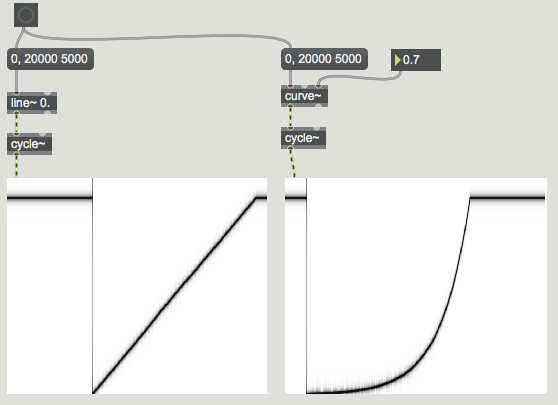
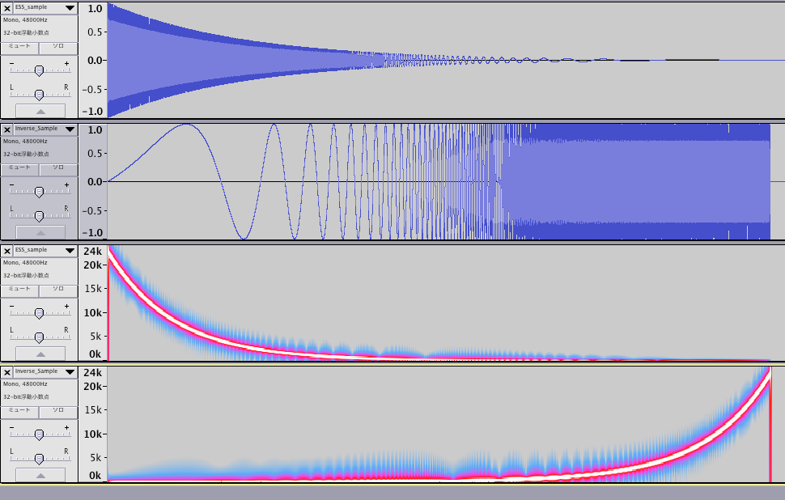

皆さん、インパルス応答は好きですか？僕は大好きです。

今回はMax/MSP/Jitter/Genのみを使ってIR測定ツールを作るということをしました。

<!--more-->

# インパルス応答とは？

インパルス応答とはあるシステムにインパルスを入力した時の応答の様子です。少し音楽寄りな解釈をすると

- あるエフェクターに超短いパルス波を入れた時の出力

です。インパルスには(サンプリング周波数/2までの)すべての周波数成分が均等に含まれているのでこれを測定すると周波数応答などを知ることが出来たり、例えば音楽ホールのインパルス応答を録っておけば任意の音源にその響きをつけることが出来たりします。

使えるエフェクターの種類は**線形時不変システム**と呼ばれるもので、入力振幅ををN倍したら出力もN倍されるもの、どの時間に入力しても同じ出力を返すものです。

簡単に言うと短いディレイの集まりで構成されるシステムと思うのがよいです。具体的にはディレイ、リバーブ、フィルター（EQ）など。
モジュレーションディレイとか、音量で特性を変えるアクティブEQとかは当てはまりません。
<small>EQがディレイ？と思うかもしれませんがフィルターは基本的にごく短いディレイの集まりで周波数ごとの干渉を作っていると捉えられるので、ディレイの仲間です。</small>

# インパルス応答の測定法

さて、これを測定するには簡単にいえばインパルスを出して録音すれば終了なのですが、スピーカーでインパルスを出力しようと思うとインパルスはエネルギーが強すぎてスピーカーをふっ飛ばしたりするので、ピストルを使ったり、風船を割ったりすることでインパルスっぽいものを出して録音するという方法を昔はとっていました。しかしどうやっても理想的なインパルスを作るのは難しいので、最近は主に別の方法が取られます。

- ノイズバースト（M系列信号）を使う方法
- Time Stretched Pulse(Sine Sweep)を使う方法

前者については勉強不足なので今回は解説なしですが、前者のほうが突発性ノイズに強く（あとリソース負担が軽量）、後者のほうが定常性ノイズに強いという特徴があります。

# TSP（SineSweep）

さて、インパルスにはすべての周波数成分が均等に含まれていると言いました。あれ、それってホワイトノイズじゃないの？と思うかもしれませんが、ホワイトノイズの周波数成分は音圧よろしく「均等にランダム」で、ある一定長で切り出した周波数成分を平均化していけば均等な周波数成分に収束していくというわけです。ホワイトノイズのヒストグラムがガウス分布に近づいてくのと似たようなもんです。

というわけで、サンプリング周波数に対応した**同位相の**すべてのサイン波を足し合わせるとインパルスが出来ます。
ここで個別のサイン波の位相を少しづつずらして行くとTime Stretched Pulse(時間引き伸ばしパルス)というものが出来ます。
時間軸上ではサイン波の周波数を0からサンプリング周波数/2まで順次変化させていったもの等価になるのでSine SweepとかSwept Sineという風にも呼ばれます。

イメージで言うとこうです。実のところJitterとかGenとか持ち出さずともこれだけでも測定信号としてはほとんど十分だったりします、、、

そして、この信号をスピーカーなどで出力して、システム（エフェクターとか、部屋とか）を通しマイクで録音し、TSPを周波数領域で割り算して取り出してあげます。説明がややこしいので省略しますが、周波数領域でTSPで割り算するのは、TSPを時間軸上で反転した波形（up-TSPに対してdown-TSP）を周波数領域上で掛け算（畳み込み）することに当たります。

# TSP(Linear Sine Sweep)とPink TSP(Log/Exponential Sine Sweep)

TSP信号において、周波数を直線上に変化させるやり方にはいくつかの問題があります。
例えば10秒かけてスイープする信号を作ると、後半5秒は10000Hz~24000Hzとかになるので、かなりの高周波成分になってしまいます。
ので、スイープの仕方を対数カーブにしてあげようというのがLog（もしくはExponential） SineSweepです。
周波数成分的に考えると、均等に含まれていたTSPより低音の鳴っている時間が長くなるので、高域に行くに従って減衰するような周波数成分になります。これがピンクノイズと同じ-3dB/octになるようなカーブなので、Pink-TSPと呼ばれたりします。呼び方のバリエーション多すぎ。Pink-SineSweepとかいう人もいます。
<small>ついでに言うと、対数カーブではなく折れ線型の周波数カーブを作るoptimized-Sinesweepというのもあります。</small>

Pink-TSPの逆フィルタはPink-TSPを前後に反転したあと、高域の減衰を補正するような+6db/octの振幅を掛けた形になります。
-3db/octの信号に、-3+6db/oct=+3db/octの信号を畳み込むと±0db/octの信号になるわけです。
こんな感じです。間違えて名前逆になってますけど上が逆フィルター、下がスイープ信号です。

TSP信号は定常性ノイズに強いとの記述をしましたが、スイープ時間を長くするほどノイズ成分は平均化され少なくなります。また複数回録音した波形を平均化することでもノイズが減らせます。(ただ、あまりに何度も足し合わせると高域側ほど相関が低いためロールオフしてしまう、とのことで少ない数で長い信号を使うのが最近の傾向だそうです。)

もう一つのメリットとして、歪のような非線形成分がマイナス時間の応答という形で現れるので、望まない歪成分を分離することができたりスピーカーの歪み測定などにも使われるようです。

# FarinaのExponential Sine Sweep

TSPを作る方法は周波数領域で振幅と位相を予め計算して逆フーリエ変換して時間波形を取り出すというやり方が一般的です。
しかし先ほど述べたようにTSPは時間軸上でサイン波の周波数を上げていったものと等価なのではじめから時間領域で作ってしまうことも可能です。
このやり方だと、開始と終了の周波数をサンプリング周波数にかかわらず自由に決められるというメリットなどがあります。

主にこの方法で有名なのはスペインのAngero Farina先生で、彼のサイトにはたくさんPDFで資料が載ってますので、もっと詳しい話を見たい場合はここを見るのが有益です。

[Angelo Farina's Home Page http://pcfarina.eng.unipr.it/](http://pcfarina.eng.unipr.it/)

[\[pdf\] IMPULSE RESPONSE IMPULSE RESPONSE
MEASUREMENTS BY MEASUREMENTS BY EXPONENTIAL SINE SWEEPS EXPONENTIAL SINE SWEEPS](http://pcfarina.eng.unipr.it/Public/Presentations/audioprecision-workshop.pdf)

長くなりすぎたので実際のパッチ作成は次に進みます。

[JitterとGenを活用してインパルス応答測定(2)](/blog/2016-06-11/log-sinsesweep-jitter-gen2/)
