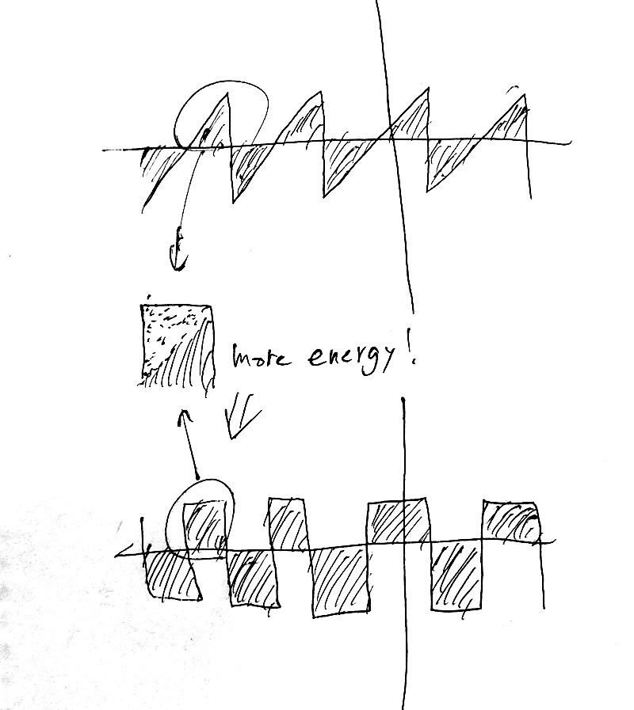
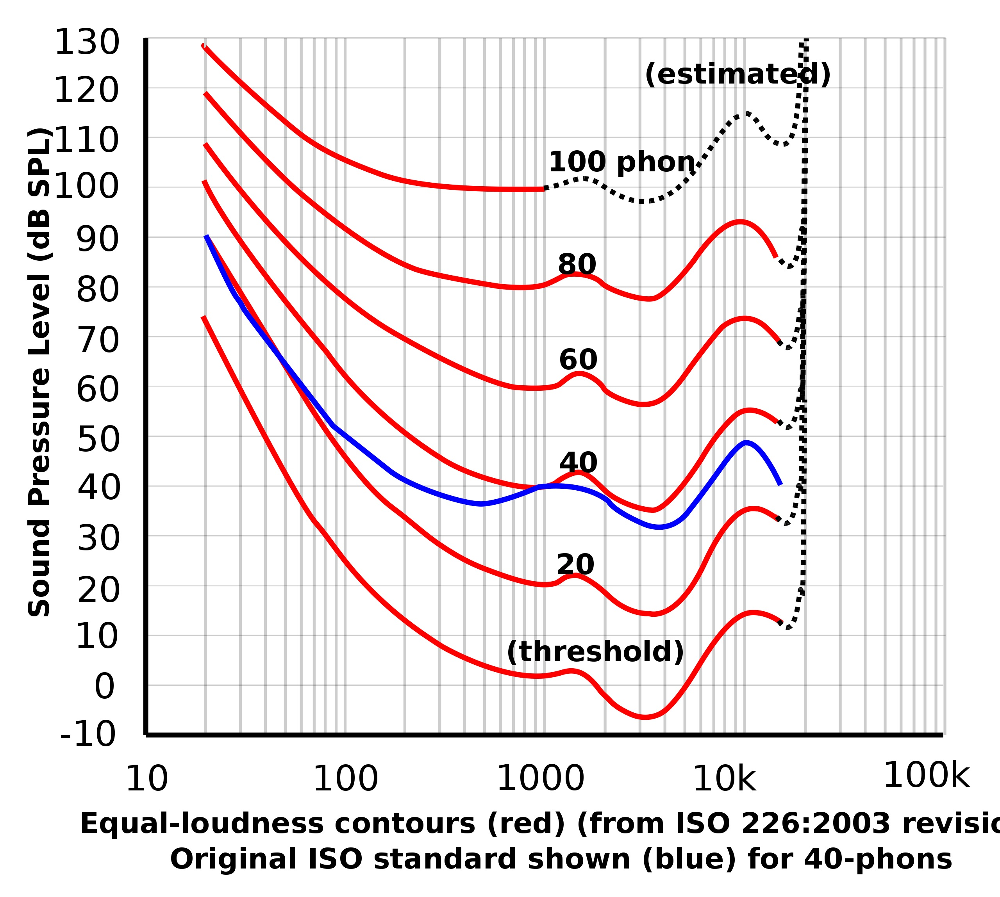
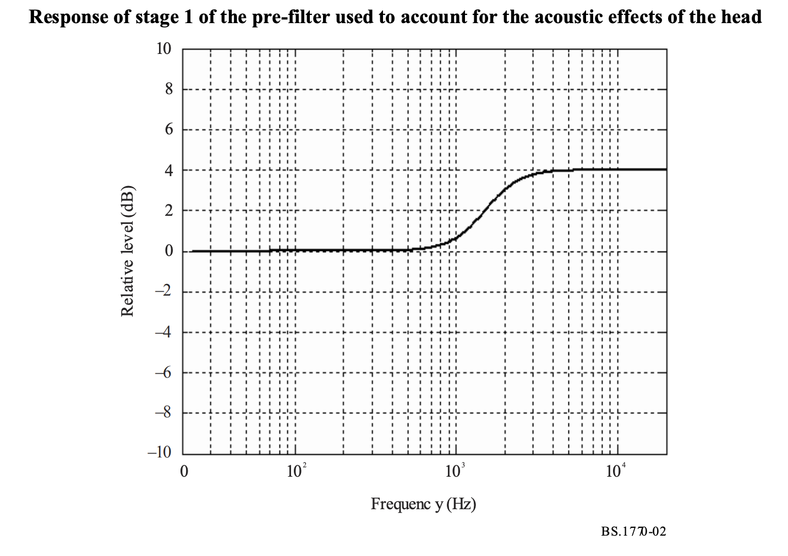
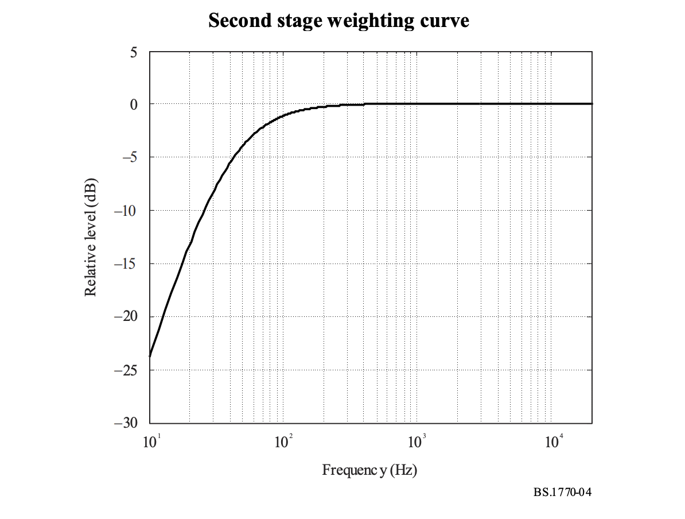
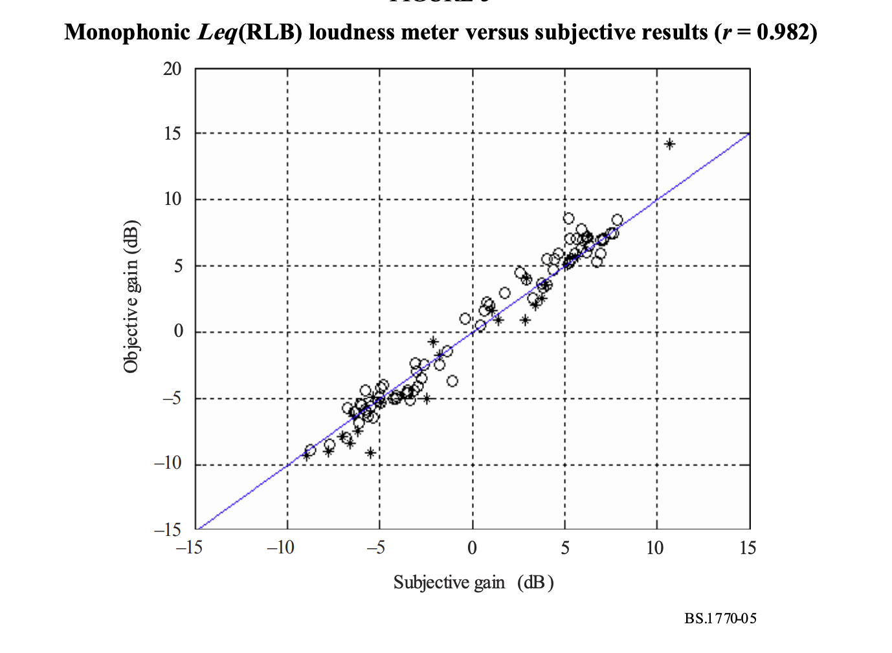

[ミト（クラムボン）インタビュー](https://note.com/onojima/n/n57fe957a2c62)

[小野島　大](https://note.com/onojima)さんによるクラムボンのミトさんへのインタビューを読んで思ったこと。多分インタビューの中心とは違う部分なんだけど、ラウドネス規制に関する部分。

> ミト「今、日本のテレビ業界はラウドネス規格という音量調整基準が使用されてるんですけど。実はこれ音楽家にとっては非常に弊害があるんです。音が大きすぎないようにリミッターをかけるんですけど、こちらが大きすぎるとものすごい勢いで小さくなり、迫力もなくなるんです。ただ、そのラウドネス規格の音域って大雑把にいうと実は上側、ギターの音だったりボーカルの音だったり中高域が基本メインなんですよ。低域はあんまり重要じゃないんです。だからこそ僕はその低域を武器にしたらいいんじゃないかなと思ったんですよ。そうしたら、どんどんネットで配信されているサブスクのものも同じようなラウドネス規格を持ち始めて」
>
> (中略)
>
> ——ラウドネス・ノーマライゼーションによって中高域を押さえ込まれちゃって、でもローの部分に関してはその弊害みたいなものが少なかったから、ローの方を強調するように音作りが変わっていったっていうことですか。
>
> ミト「きっかけはそうだと思います。今は、その辺りもちょっとは気にされてはいるんですが、それでもやっぱりApple MusicやSpotifyのああいうサブスクのチューニング的なものが大きいと思います」
>
> ——ああ、空気感を重視しない方向っていうのはそういうふうなきっかけもあったっていうことなんですかね。

これ、個人的には結構、そういう捉え方をされ始めてるんだなと驚いた部分だった。

ラウドネス規格というものが生まれた背景を少し説明する(知ってる人はすっ飛ばして良い)。

<small>(あらかじめ補足しておくと、この記事で使われる音圧という語は物理的な圧力（Sound Pressure Level）のことを指し音量というのは心理的な聴感上の音の大きさ（Loudness）を指す。日本では一部語の用法が逆転することがある。)</small>

音声を表現するにあたって音圧波形には上下の限界が設定される。例えばCDの16bitであれば−32768から32767の65355段階で音圧を表現することができる。

この時、同じ周波数の音でも音色によって詰まっているエネルギー量が変わることが起きる。例えば16bitに収まる最大振幅のノコギリ波の面積は、最大振幅の矩形波(Rectangular Wave)のおおよそ半分になる。

「音の大きさ」を雑に比較したければこの面積を比較すれば良い。一般的に言われるRMSと呼ばれる計測の方法はそんな感じだ。

さて、ラジオとかでいろんな曲を流すにあたって音量が大きいということは基本的にそれだけで有利なことになる。上下の限界がある中でなるべく音を大きく聞かせたければ、まず、1曲の中で音が一番大きくなる部分を32768になるようにスケーリングしてやればよい。そこまでは当然みんなやってくるし、これは音質的な影響を与えることはない。これをスタートラインとして、さらにできるだけ音を大きくしていくためには、先ほどの矩形波のようになるべく面積を大きくしてやれば良い。

このためには基本的にコンプレッサーと呼ばれる、音量が一定以上大きくなったらボリュームを絞るエフェクトを使う。一曲の中での音量差をなるべく小さくした上で、改めて上限いっぱいまでスケーリングし直すことで音量が上がる。さらに高度なことをやろうと思うと、マキシマイザーと呼ばれるエフェクトを使うことになり、これは各社アルゴリズムが秘伝のタレ的なものなので詳しいことはわからないにせよ、例えば周波数ごとの波形のピークが重ならないように位相をずらしたりすることで音質にはほとんど影響を与えず面積を増やすことができるようになる。

この弊害として、みんながみんな面積を大きくしようと躍起になること(音圧戦争/Loudness War)で音楽がいわゆる海苔波形化する＝音量が極端に平坦になるということがよく挙げられる。ちなみに英語では海苔ではなくてソーセージと呼ばれたりもして、マキシマイザーの有名なプラグインの名前として[Sausage Fattener](http://www.dadalife.com/sausage-fattener/)なんてものも存在するくらいである。

まあ、今やこの手のパツパツに詰まった音も一種の音楽スタイルとして成立し始めている気もするものの、聞こえの音量がでかいほど曲が売れるみたいな状況も起きていないとは言えない訳で結構深刻な訳である。

そこで2000年代後半ぐらいからラジオやテレビ、映画で音量を統一する規格が策定され始める。現在使われている規格の大元は国際標準化団体ITUによるITU-R BS.1770と欧州放送連合EBUのEBU R 128というもの。

ここで使われている単位LUFS(ITU-RではLKFSだが、中身はほぼ同じ)は、先ほどの面積での比較RMSにもう少しだけ人間の聴覚上の補正を行ったものである。

人間は同じ音圧エネルギーでも周波数によって聞こえる音の大きさが変わるという特徴がある。次の画像は東ラウドネス曲線と呼ばれるもので、どのくらいの音圧が同じ音量に聞こえるかを周波数ごとにプロットしたものである。

（画像はWikipediaより、パブリックドメイン）

大まかな理解では同じエネルギーなら1000Hzより下ぐらいから、低い音の方が小さく聞こえる、ということになる。

そうなると、RMSを使って音量を揃えていこうとすると、同じRMSでも高い音をたくさん詰め込んだ方が聞こえの音量が大きくなってしまうことになる。そのためにあらかじめこのカーブを逆算したフィルタを掛けてからRMSをあらためて測る、というのがLUFSの考え方。

具体的には、いったん高い方の音を強調して、

低い音を減衰させる。

ずいぶん大まかな簡略化したもんだなと見えるが、実際このフィルタで主観評価をするとまあかなりいい線行っているらしいことがわかる。

（以上3つはITU-R BS.1770-4よりhttps://www.itu.int/rec/R-REC-BS.1770-4-201510-I/en）

これで晴れて、おおよそ人間の聴感上通りの音量で音楽を並べることができるようになり、一応のところ音圧戦争は終焉した、という流れになる。EBUで導入され始めたのが2012年から。確か2015年あたりからApple Music(あの頃まだiTunesだったか)やSpotify、Youtubeのような、公共電波的なものでない場所でもこのラウドネスノーマライゼーションは適用されるようになっていった。

---

ので、原理的にはインタビューにあったように低音の方が目立つ、というような言い方はちょっと違うような気はするのだけれども、「空気感」みたいなものがどんどん減っているという話の方には、実感としてもわかるものがあるし、説明もつく気がする。

おそらく、同じ音量でノーマライズされた音楽であれば、残響成分が少なく直接音が多ければ多いほど音が「近い」感じになり、同じストリームで流された時には目立つように聞こえるのではないか？

まあ、市場が違うので誰もノータッチだったけどラウドネスノーマライズした後だって明らかにクラシック音楽とか（長い曲の中での音量差が激しいみたいな要因を込みにしたって）明らかに奥に引っ込んでるように聞こえるよね。

詰まるところ、我々がノーマライズしなければならなかったのは実は音量ではなくより高次のパラメータである**目立ち感**みたいなものだったのではなかろうか。

もちろん、ここ数年の音楽の流行りの傾向の変化の全てがラウドネスノーマライズが引き起こしたものだと考えるのはやりすぎだとしても、この音楽のジャンルの潮流の変化にこうした技術規格が少なからず影響を与えているらしい（少なくとも第1線で活動するミュージシャンにそう捉えている者がいるという事実は大きい）というのは個人的に結構衝撃的である。

あれ、でもそもそもラウドネスノーマライズって音量がパツパツに詰まったEDMみたいなのばっかりが市場で勝つのはヤバいみたいな危機感あって作られたはずだよな、少なくともこの規格の裏にはそうでないアコースティックなミュージックがもっと報われるように、、、という言外の思想がおそらくあったはずだよな、結果的に当のアコースティックな空気感を持つバンド音楽には不利に働いているというのはどういうことだ？

さてしかし、ここまで考えてくると今度は新しい疑問が湧いてくる。我々はこの目立ち感をノーマライズするべきなのか？Loudness Normalizationに次ぐPresence Normalizationが規格化される日はやってくるのだろうか。

おそらく昨今の聴覚情報処理の発展を鑑みるに、目立ち感に関する主観評価実験を行って、測定アルゴリズムを考案するまでにはそこまで労力が必要ないようにも思う。

しかし音量と違って残響成分の有無は間違いなく音楽のコンテンツそのものに関わるファクターである。そこで公平性を考え始めるとマジでキリがなくなるんじゃないのか。そもそも音楽において公平さとは何をもって担保される？音楽におけるNormalとNormは誰がどう定めるのだろうか？

---

一つディストピアっぽい解決方法を挙げるのであれば、目立ち感そのものを資本として売り買いしてしまうというやり方がある。

例えばApple Musicとかストリーミングのラジオ内で、配信するアーティストが課金すると一定期間ストリーム内での音量を数dB上げてくれるということになれば、そもそも公平などなく競争社会があるだけだという諦めがつく。公共空間でできるだけ目立つように広い面積の屋外広告を高いお金を払って買うように、音楽ストリームという擬似公共空間で目立つための音の面積＝目立ち感を課金して確保する。

まあ、ギリ無くもないかなと思うシナリオだけどどうだろう。しかしそう思うと、今のストリーミングサービスが課金すれば自分の聴きたい音楽だけきちんと聴けるようになっている（突然広告が割り込んできたりしない）のってまだまだ良心的な方だよなと思う。

BlackOutTuesdayの時にAppleMusicが1日ブラックミュージックを聴くチャンネルだけに絞った運動に対して結構批判している人がいた。個人的には「うるせー嫌ならとっとと解約しろ」という思いもあるにせよ、あの場で明らかになったのは、ストリーミングサービスとはレコードやCDのようにオブジェクトとしての楽曲を能動的に選択してコレクションする時間的体験をできる限りインスタントにできるようにしたものだったはずが、突然ラジオと同じように受動的な公共空間にスイッチされたことへのショック的反応なんだろうなと思うと、まあちょっと同情する気もなしではない。U2のアルバムが勝手にライブラリに差し込まれた時の批判と並列している人もいたけれど、個人的には少し違う気がする。（してない選択をしたことにされた、という点では同じなのだが）

極論、いくつかの曲を続けて聴くという体験をするだけで私たちは公共空間に身を置いていることになる、という意識に気がつき始めた、みたいなことだと思う。音楽を並べて聴き比べるとその違いに気づく。その不均等さはどこまでが不公平で不均衡で、どこまでが個性で、どこまでを規制し規格化し標準化し、どこまでを売り買いのリソースにしうるのか。

俺はポピュラーミュージックのそういうところがエンジニアとして面白くて、興味深くて、音楽家として嫌いな部分だなと再認識した。おしまい