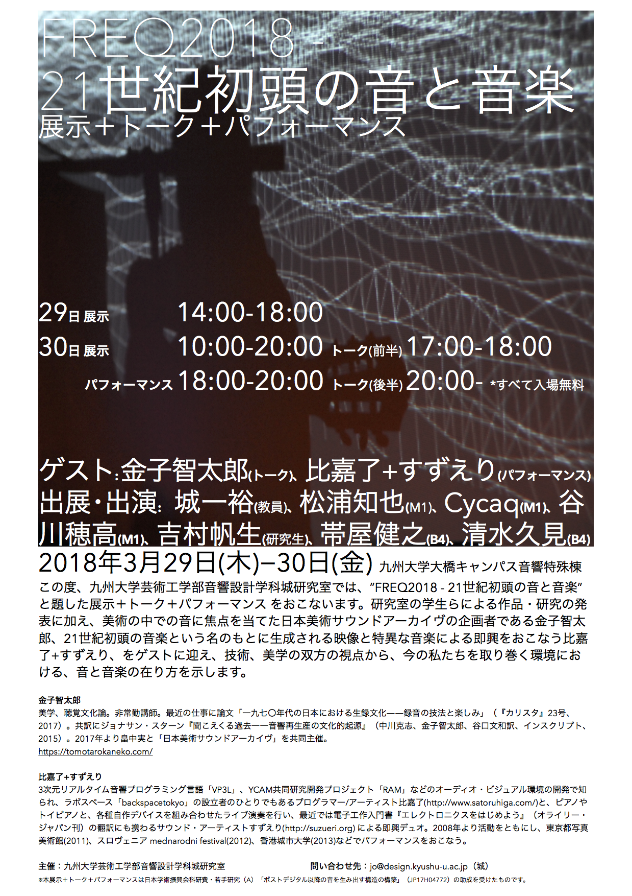

2018年3月29日(木)−30日(金) に、所属する城研究室の展示＋トーク＋パフォーマンスのイベント"FREQ 2018 ―21世紀初頭の音と音楽―"が開催されます。松浦は昨年2回展示した[Aphysical Unmodeling Instrument](/works/aphysical_icsaf17)という作品を無響室で（!）展示します。また、30日のパフォーマンスでは新しく制作している電子音響楽器「Exidiophone」でのパフォーマンスを行います。ぜひご来場下さい。

<!--more-->

# 概要

> この度、九州大学芸術工学部音響設計学科城研究室では、”FREQ2018 - 21世紀初頭の音と音楽”と題した展示＋トーク＋パフォーマンス をおこないます。研究室の学生らによる作品・研究の発表に加え、美術の中での音に焦点を当てた日本美術サウンドアーカイヴの企画者である金子智太郎、21世紀初頭の音楽という名のもとに生成される映像と特異な音楽による即興をおこなう比嘉了+すずえり、をゲストに迎え、技術、美学の双方の視点から、今の私たちを取り巻く環境における、音と音楽の在り方を示します。
>
> 日時：
> 2018年3月29日(木)−30日(金) 
> 3月29日 展示 14:00-18:00
> 3月30日 展示 10:00-20:00 
> トーク(前半) 17:00-18:00 
> パフォーマンス 18:00-20:00 
> トーク(後半) 20:00- 
>
> 場所：
> 九州大学大橋キャンパス音響特殊棟
>
> *すべて入場無料
>
> ゲスト：
> 金子智太郎(トーク)、比嘉了+すずえり(パフォーマンス)
>
> 出展･出演：
> 城一裕(教員)、松浦知也(M1)、Cycaq(M1)、谷川穂高(M1)、吉村帆生(研究生)、帯屋健之(B4)、清水久見(B4) 
>
> プロフィール：
> 金子智太郎
> 美学、聴覚文化論。非常勤講師。最近の仕事に論文「一九七〇年代の日本における生録文化――録音の技法と楽しみ」（『カリスタ』23号、2017）。共訳にジョナサン・スターン『聞こえくる過去――音響再生産の文化的起源』（中川克志、金子智太郎、谷口文和訳、インスクリプト、2015）。2017年より畠中実と「日本美術サウンドアーカイヴ」を共同主催。
> [https://tomotarokaneko.com/](https://l.facebook.com/l.php?u=https%3A%2F%2Ftomotarokaneko.com%2F&h=ATMVg_fEbrOj9P_mcMicfP-cHOFpQhyVf7jFoX_c6iQb8ksZ3ykhcHNrouxJeFfD0g9r-WkdG2Zzn8_eAz7CTKNEk-xs_YM8f7Y9t-WabG-a5uzPzb8x2Yyi7QY)
>
> 比嘉了+すずえり
> 3次元リアルタイム音響プログラミング言語「VP3L」、YCAM共同研究開発プロジェクト「RAM」などのオーディオ・ビジュアル環境の開発で知られ、ラボスペース「backspacetokyo」の設立者のひとりでもあるプログラマー/アーティスト比嘉了([http://www.satoruhiga.com/](https://l.facebook.com/l.php?u=http%3A%2F%2Fwww.satoruhiga.com%2F&h=ATNPAFMWg9KxeS7q1say97YZx5IUzzyxm-wNUL8Ajt3LxyDsygtbZteEblPFQh3D4sGdumb5NLZPL5-x4_nF4q7jhbGUzF-bVTvr8z0OLyFdS2FE_ItVHxObSYM))と、ピアノやトイピアノと、各種自作デバイスを組み合わせたライブ演奏を行い、最近では電子工作入門書『エレクトロニクスをはじめよう』（オライリー・ジャパン刊）の翻訳にも携わるサウンド・アーティストすずえり([http://suzueri.org/](https://l.facebook.com/l.php?u=http%3A%2F%2Fsuzueri.org%2F&h=ATPkoL4QufzZ7qzJpK0WiOlFrJnAhsHMFeIC1jaQvI5w4aibi4ABK6LRBKycu-woDNc7CQ-JGMqZpRQLOAbj7GfFqDBuvUur-K4BmCQwTXzOoHIUb3FYXY3mv28)) による即興デュオ。2008年より活動をともにし、東京都写真美術館(2011)、スロヴェニア mednarodni festival(2012)、香港城市大学(2013)などでパフォーマンスをおこなう。
>
> 主催：九州大学芸術工学部音響設計学科城研究室 
> 問い合わせ先：jo@design.kyushu-u.ac.jp（城）
>
> ※本展示＋トーク＋パフォーマンスは日本学術振興会科研費・若手研究（A）「ポストデジタル以降の音を生み出す構造の構築」（JP17H04772）の助成を受けたものです。

# Aphysical Unmodeling Instrument

[2017年10月のはならぁと ぷらすでの展示記録](/works/aphysica_hanarart)

[2017年12月のインターカレッジ・ソニックアーツフェスティバル2017での展示記録](/works/aphysical_icsaf2017)

Aphysical Unmodeling Instrumentは、Whirlwindという抽象的な物理モデリング音源を物理的に再実装する作品である。

物理モデリング音源とは実際の楽器の音色をコンピュータ上で楽器の挙動をシミュレートすることで再現しようとするものであり、Whirlwindはその研究過程で90年代に開発された、トランペット、フルート。クラリネットを合体させたような音源だ。

本作品はWhirlwindの各計算要素を物理的要素で―例えば遅延を音波伝播の遅延で、共鳴をヘルムホルツ共鳴器で―置き換えて再実装する。音におけるデジタルの概念をモデルの構築という作業から捉え直す試み。

# Exidiophone

自作電子音響楽器“Exidiophone”を用いたサウンドパフォーマンス。Exidiophoneはマイクロフォンをスピーカーに近づけると音が出るハウリングという現象を逆転的に楽器の主要素として扱う楽器である。

Idiophoneとは体鳴楽器という楽器の分類法の一つで、ドラムのような膜鳴楽器やピアノのような弦鳴楽器ではなく、シンバルやマリンバのように「物それ自体が鳴る」という意味から来た名前だ。

スピーカーとはSpeaker、つまり喋る人のことで、人の代わりに大きな声を出したり、録音された声を喋ることで情報を再生するものとして作られている。マイクロフォンはMicro＝小さなphone＝音、つまり小さな音を拾い上げて拡大する、元々の聴診器などでの役割からきた言葉だ。仮にスピーカーやマイクが今ある音、音楽を全て再生/録音できるとして、それらの領域を塗りつぶしてなおスピーカーとマイクでしか出せない音の領域が残っているはずだ。

それは記録/再生でない「スピーカー/マイクそれ自身が鳴らす音」である。"Ex"idiophoneは「物それ自体が鳴る」Idiophoneの概念を、そして既存の電子楽器の考え方をも拡張する。

---

「Aphysical~」は既に二回展示しているとおり別に無響室スペシフィックな作品でもないのですが同じ差k品だけど展示環境に合わせてどんどん形態を変えていくように作っているのでひとつエクストリームな環境で試せるのはよかったです（単に学校に展示向けの部屋が無いみたいな話もあるんですが）。
