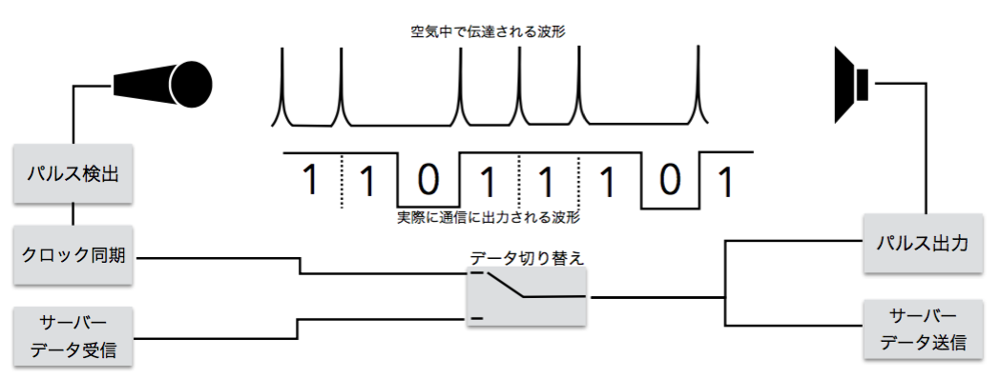
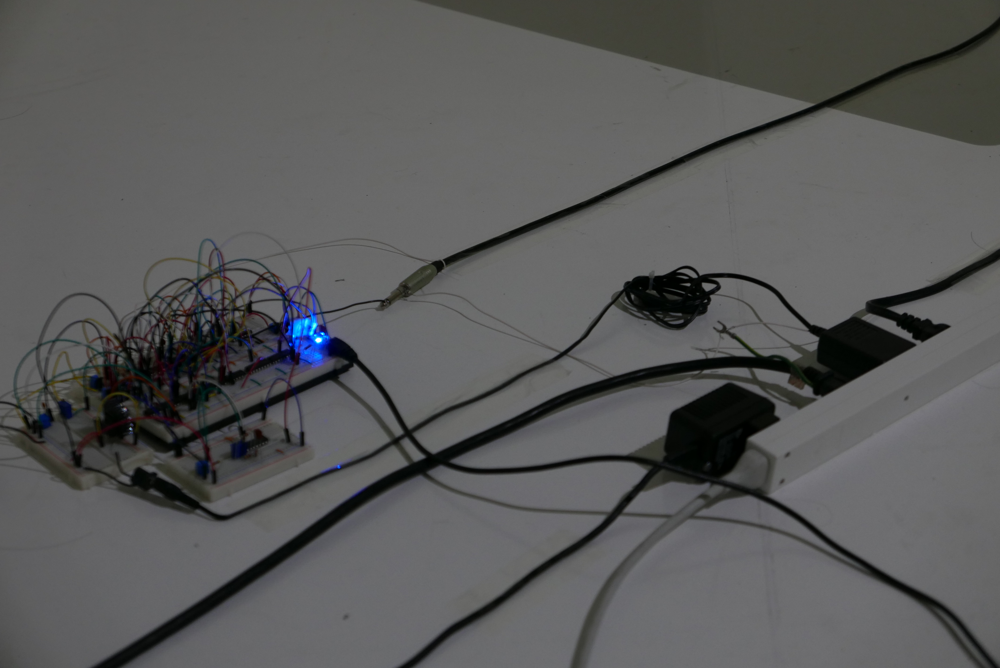
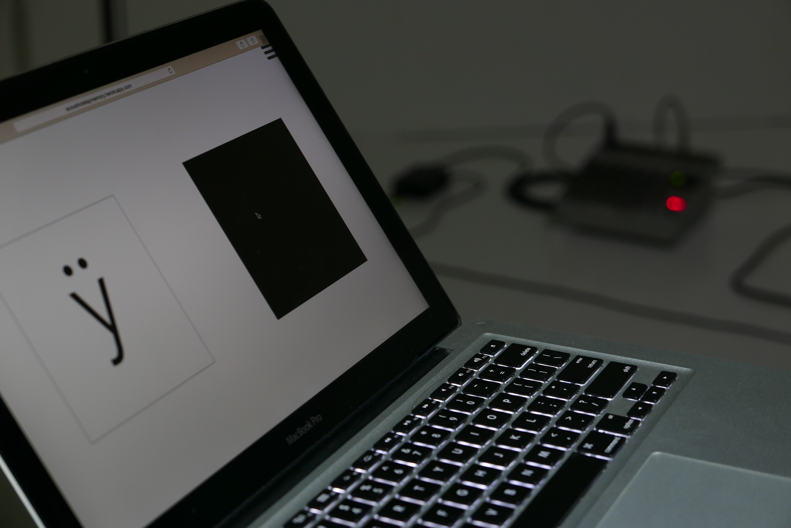

Presented at Senju Art Path 2015(Annual Student Exhibition of Senju Campus, Tokyo University of the Arts)

<iframe src="https://player.vimeo.com/video/162286132" width="640" height="360" frameborder="0" webkitallowfullscreen mozallowfullscreen allowfullscreen></iframe>

# Concept

A recreated acoustic delay memory, which is a primitive digital memory used in early era of electronic computer, modified to open, audible and enable to read/write data over the internet.

---

In this work, 1 byte = 8 bit binary data is stored in an acoustic delay line memory, using air as its medium.

People can observe the data over an internet browser and also can modify them in real time.

A character from ascii code is shown on Left/Upper side of the viewer. User can input the character with keyboard and data is transmitted when the enter key is pressed.

Black & white sequences of rectangles are shown on Right/Bottom side according to a current data sequence. User can click each rectangle with a mouse cursor and invert the data bit.

Acoustic delay line memory is the digital memory apparatus used in early era of electronic computer from 1946 until around 1970.

ENIAC, the first electronic computer didn't use but, it was used in next age like EDSAC, EDVAC, UNIVAC and FUJIC (a first electronic computer in Japan).

Acoustic delay memory has piezo-electronic sound transducer and receiver on each end of a metal tank filled with mercury.

First, it transmit binary data sequence as sonic pulses. A microphone on the other end receives them. It takes a very short, but certain time given by (distance / speed of sound). Then it re-transmit received data by amplifying them.

By recirculating data like this without changing data sequence, it stores data **by delaying a time**.

---

---

# Document 1

According to a dictionary, it means like this.

【Store】 That do not lose its original state. Keeping as it is.

When the birthday, I can't stop hesitating to eat a message-board made with a chocolate.
Though a message on the board itself does not vanish, I feel like that.
The message on the board may finished its role that sends the message. Did its information on the chocolate disappear?
Storing digital data seems something different from storing foods to prevent from going bad.

Vinyl stores sound pressure as an depth of a groove. However, using it for a long time, the information of sound will degrade (maybe not degrade but certainly make some transition from original).

Compact Disk stores bit data as physical dents. If it degrade physically, data can be completely reconstructed unless it is damaged so hard.

Then, in acoustic delay line memory, what is stored, and where?

---

