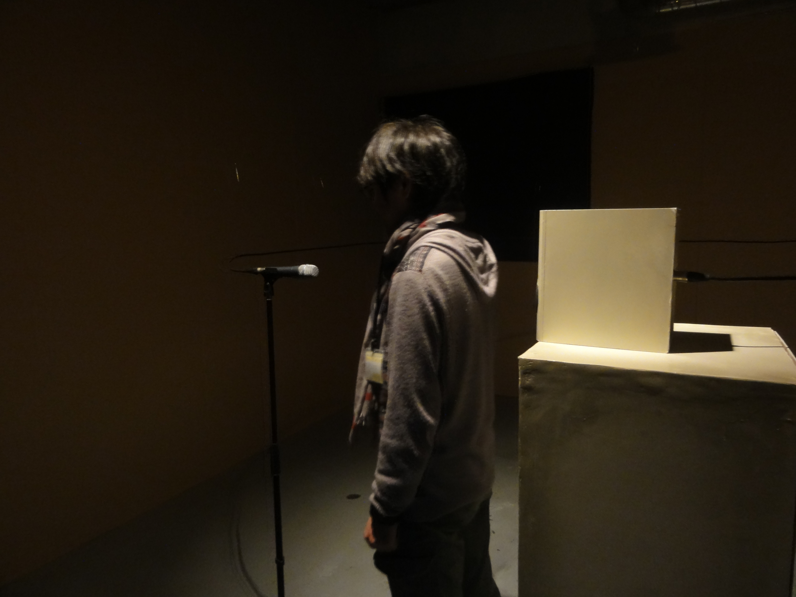

<iframe src="https://player.vimeo.com/video/165168929?color=ffffff" width="640" height="360" frameborder="0" webkitallowfullscreen mozallowfullscreen allowfullscreen></iframe>

千住 Art Path 2014（東京芸術大学千住キャンパス制作・論文発表会）にて展示

# 作品概要

宙吊りになっている円弧状のケーブルはマイクからスピーカーへ（実際には一度PCを介して）つながっている。

観客がスピーカーとマイクの間を遮ろうとするとハウリング（オーディオフィードバック）が発生するが、音量は過剰増幅されるのではなく一定に保たれるようになっている。

間を遮るものによって発される音色は多様に変化する。

普通は向かい合わせになることのないマイクとスピーカー、普通なら間に入れば音が小さくなるはずだが間を遮ると発される音。

その音は全て周りや自分の出した音が繰り返し積み重なって生まれる音である。

振動の重なりである音を実体験として捉えることを試みた。

# 文章(2017年補記)

スピーカーは理想的にはどんな音でも出せるように作られる。それである限り、スピーカーには、既存の楽器でもない、どのシンセサイザーからも出せない、スピーカーからしか出せない音があるはずだ。
それは、いま何もないところにある音を探し出すということで、録音の延長線上にある。

マイクとスピーカーの間に手をかざすと音が現れるが、この関係はある意味で偽物である。手をかざしたのを天井についてるカメラが検知してコンピュータを制御しているだけで、そこに直接的な、物理的連関は無い。しかし手をかざした時だけ音が現れると、そこに何かがあるように私たちは感じてしまう。そこには本当に「何も無い」のだろうか？出てくる音自体がマイクで拾った音を増幅し続けている事には変わりない。何も無い何かを拾い続けようとしている。

