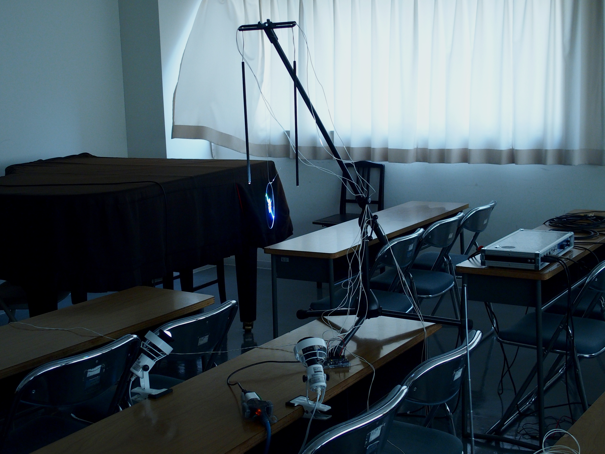

---

関連記事

[Aphysical Unmodeling Instrument(同作品の1度目の展示記録)](/works/aphysical_hanarart)

[Aphysical Unmodeling Instrument モデリングから音・音楽を再考するサウンドインスタレーション(本作品についての研究発表)](/works/jssapaper/)

---

[2017/12/16~17 インターカレッジ・ソニックアーツフェスティバル2017(ICSAF2017)にて展示](http://ic.jssa.info)

会場：昭和音楽大学

<iframe src="https://player.vimeo.com/video/253094723?color=ffffff" frameborder="0" webkitallowfullscreen mozallowfullscreen allowfullscreen style ="width:100%; min-height:360px; max-height:400px;"></iframe>

<small>動画右下CCボタンで日本語字幕</small>

<https://vimeo.com/253094723>

# 文章

「Aphysical Unmodeling Instrument」は物理モデリング合成を実空間で、物理的に再実装する作品である。

本作品は、Whirlwindというモデルとその再モデリングという行為を通して作曲と演奏という一見逆に見えるものを、共通の音を生み出すプロセスとして捉え直すことを試みるものだ。

---

---

物理モデリング合成という主に80〜90年代ごろから研究されているコンピューター上で現実の楽器の音を模倣する為の技術がある。

この手法は加算、減算、FM、ウェーブテーブル合成などいわゆるシンセサイザーの他手法と並べられることもあるが、これらの手法は技法そのものを指しているのに対して物理モデリングは模倣するという目標が定義になっており、そのため実際の技法は様々な種類がある。

その中でも計算がシンプルなウェーブガイド合成という手法は最もよく使われる。

これは管楽器のモデリングで例えると、管の中を音波が進み、管の端で反射して戻ってきて・・・という進行波の動きに各部が与える影響を計算するものだ。

その研究の中でCookらによって作られた、Whirlwindというハイブリッド管楽器モデルがある\[1\]。これは元々トランペット、フルート、クラリネットの3種類のモデルがあり、それを和集合的に合体させたモデルである。

その大まかな構造は、入力された進行波が共鳴器、歪み(拡声器越しの声のような効果だと思って欲しい)、遅延などを経てまた入力に戻ってくるという下図のような形になっている。

この構造はハウリング（カラオケでマイクのボリュームを上げすぎた時にキーンとなるやつ）と実はよく似ている。ハウリングはマイクで拾った音を音量を上げるために増幅し、スピーカーから発された音がマイクに入り、それがもう一度スピーカーから出力されもう一度マイクへ、といった具合に音がどんどんループして音量が大きくなるものだ。

この時スピーカーから音がマイクにたどり着くまでには音速分の遅延があり、音を増幅する時歪みが発生し、マイクやスピーカー、部屋の特性などである周波数が強調されたり打ち消されたりする。

さてこのような類似性の見出しをより進めると、例えば掛け算や足し算もデジタルでの計算という表現だけでなく電気回路や音響回路を使った様々なパターンの構成ができる。

Aphysical Unmodeling Instrumentはこのような考え方でWhirlwindを物理的に再実装する。下図はその構成である（実際の空間的配置とは対応していない）。

部屋の中央でCDと二つの光センサが吊るされている。CDにはスポットライトが当てられ、回転して反射光がセンサに当たることで値が変化する。片方のセンサは仮想の息の強さにあたるエンベロープとして、もう一つは金管楽器における唇の締め具合として機能する。

息を入れる時のサーッという音の要素であるノイズは、チャンネルを合わせていないラジオから流れるノイズを、マイクの前に垂らしたイヤホンから鳴らしている。

掛け算は、エンベロープと対応するLEDと、光の強さで抵抗値が変わるセンサを組み合わせて、光でコントロールするボリュームコントローラのように働くものが二つ。

それ以外にラジオの変調に使われる電気回路（ダブルバランスドミキサ）2つで置き換えられている。

遅延は音波伝搬の遅延で表現されており、スピーカーとマイクのセットで作られる。

共鳴はポリタンクの首にアクリルパイプを取り付けた、簡易的なヘルムホルツ共鳴器で構成される。唇の締め具合のパラメーターに対応して、ポンプが水の量を変え、共鳴する周波数を変化させる。

このような置き換えで、風車が風で回るとLEDが光り、マイクからスピーカーへ流れるまでの音量を変化させハウリングのように音が出たり出なかったりする。

------

Whirlwindが特徴的なのは、模倣することが目的だったはずのモデリングが、3つの楽器が合体したものという現実には存在しない楽器を対象としていることでゴールを失っているという点だ。

これは例えば作曲と演奏の関係に似ていないだろうか。作曲家の頭の中にある理想の音楽があって、それをよく振る舞うように楽譜というフォーマットで記述している。
演奏者がその楽譜を読み、演奏してみて、自分の頭のなかで想像していたものとの差を埋めていく。

しかし当然作曲家の頭にあるモデルと演奏家のモデルが異なっているので、元のモデルを完全に再現したものが演奏されるわけではない。つまり「モデルの記述からモデルを想像する」「モデルをモデリングする」ような事が起きていると言える。そして演奏も作曲もどちらもモデリングという共通した行為になっている。

本作品はWhirlwindの目標としている、あるいはモデル記述する際に頭のなかに浮かんでいた（はずの）モデルを勝手に想像して補完し、モデルの実体を作り上げるプロセスと、その成果物だ。それはあるモデル記述からもとのモデルを想像する演奏にも似るかもしれないし、自分の頭のなかにある理想を実体化する作曲とも似るかもしれない。

## 参考文献

[1] Cook, P. R. (1992). A meta-wind-instrument physical model, and a meta-controller for real-time performance control. In ICMC Proceedings.
