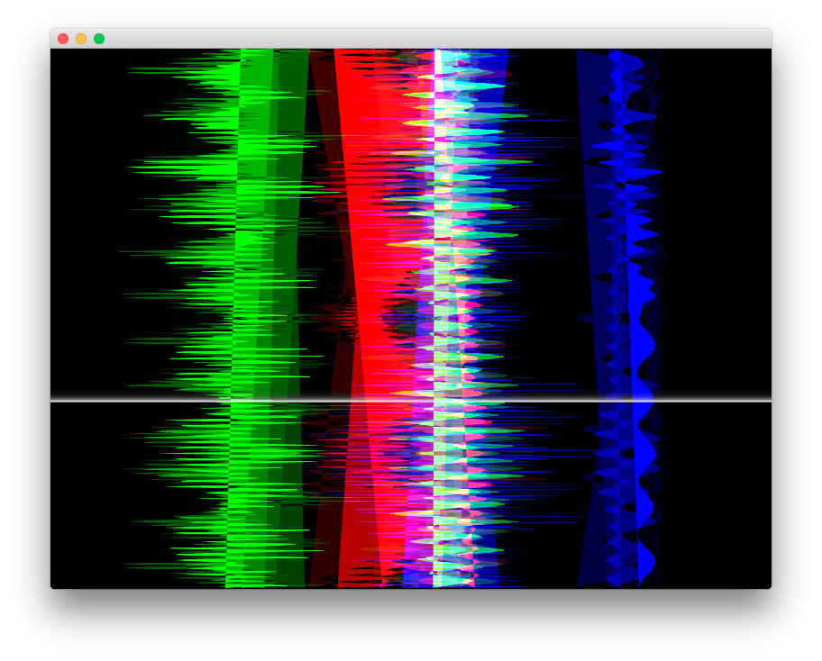
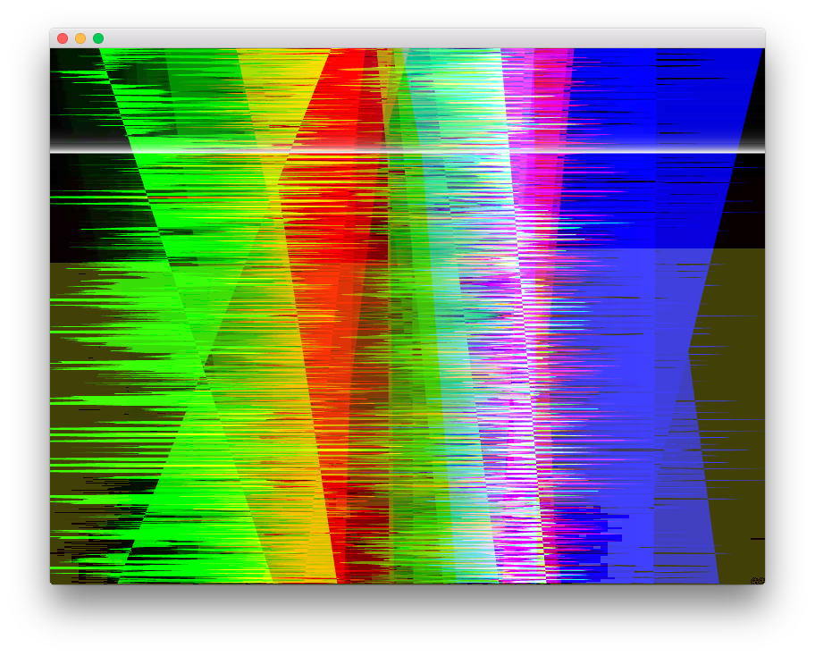

東京藝術大学 2014年度 AMC開設講座「インタラクティブ・ミュージック2」にて

[AMC（東京藝術大学情報芸術センター）アーカイブページ](https://geidaiamc.tumblr.com/post/114567474767/%E3%82%A4%E3%83%B3%E3%82%BF%E3%83%A9%E3%82%AF%E3%83%86%E3%82%A3%E3%83%B4%E3%83%9F%E3%83%A5%E3%83%BC%E3%82%B8%E3%83%83%E3%82%AF%E2%85%A1%E6%88%90%E6%9E%9C%E7%99%BA%E8%A1%A8%E4%BC%9A-%E4%BC%9A%E5%A0%B4%E8%8A%B8%E8%A1%93%E6%83%85%E5%A0%B1%E3%82%BB%E3%83%B3%E3%82%BF%E3%83%BC-%E3%83%A9%E3%83%9C%E3%83%A9%E3%82%A6%E3%83%B3%E3%82%B8)

<iframe width="610" height="400" src="https://www.youtube.com/embed/k5f98FPbETc?rel=0&amp;start=1530" frameborder="0" allowfullscreen></iframe>

# 作品概要

音は映像の情報を、映像は音の波形を出力することでお互いを相互変換していくオーディオ・ビジュアルフィードバックパフォーマンス。

アプリケーションは映像・音共にOpenframeworksで開発、コントロールGUIをPuredataで制作した。

# スクリーンショット

コントロール用パッチの画面

# システム

## オーディオ→ビジュアル

映像はRGBの波形が2つづつの計6本で構成される。
主に左側にでている波形は左チャンネルの、右側は右チャンネルの波形を表している。（実際には6chあるが、各RGB波形は音にする時足し合わされている。）

波形を描く水平位置、波形の幅（強さ）、波形の塗りつぶしなどはPuredata側から操作できる。またビジュアルは任意のタイミングでjpgグリッチ出来るようにも鳴っている。

## ビジュアル→オーディオ

ビジュアルでは白い水平の線が上から下へシークしていく。
各フレームごとに白い線の段のピクセルをスキャンし、その左半分、右半分の各RGB値を周波数成分として取得する。

取得した周波数成分を逆FFTし次の音の出力とする。

# テクニカルtips

オーディオバッファサイズとビジュアルのスキャンするピクセルの数はofFboを使ってオーディオ側に一致させている。

またビジュアルのフレームレートとオーディオのバッファの間隔が完全に一致しなければならない。かつオーディオバッファにビジュアルと音から同時アクセスがあると死ぬので、本来はupdate()とaudioOut()においてmutexを使用すべきだがよくわかっていなかったのでフレームレート側を無理やり合わせている。多分ビジュアルがオーディオから1フレーム分遅れたやつにアクセスしているので落ちなくて済んでいるような気がする。
