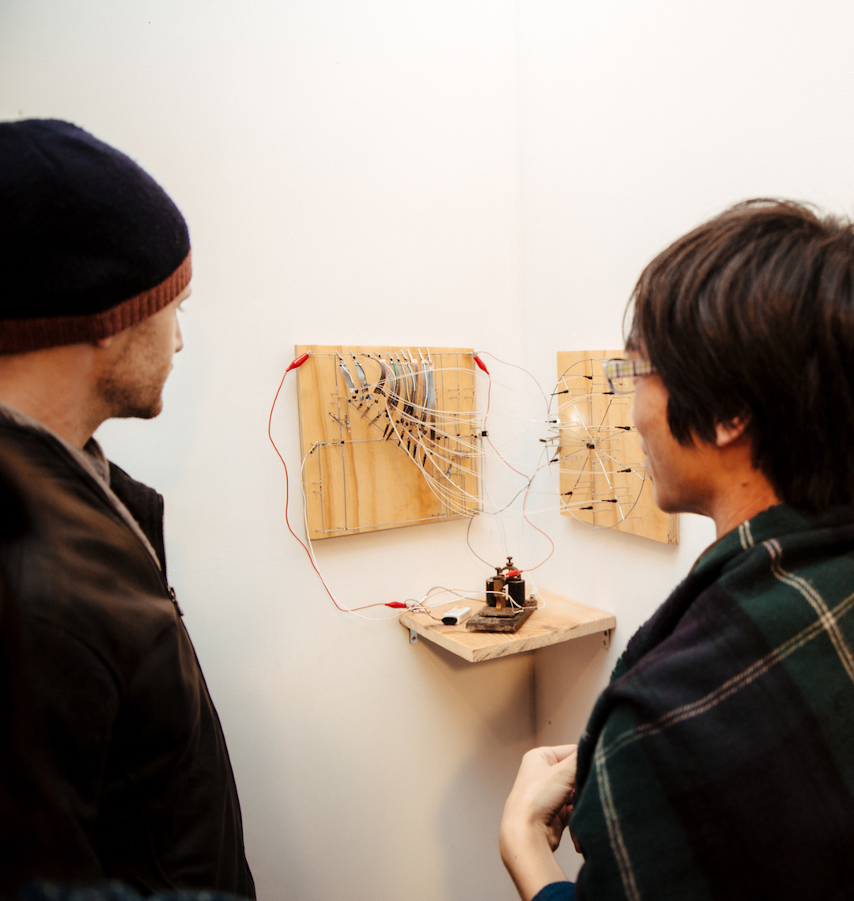
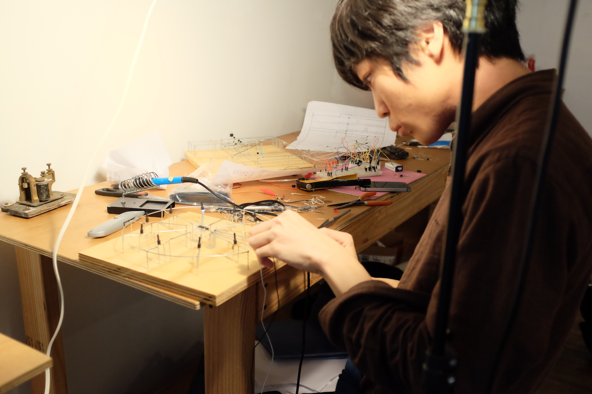

photo above is by Filip Wolak.

時間を時間のままプログラミングするために作られた、もう一つのあり得る形のパーソナルコンピューター。
マスタークロックを持たず、それ故に時間の最小単位も持たない。
このコンピュータの機能は物理的にプログラムされた通り、時間を分割することだけである。

[School for Poetic Computation](https://sfpc.io) Fall 2018 classにて制作、Student Showcase（2018年11月10、11日）にて展示。

# 時間の計算について

今日のコンピュータのほとんどがマスタークロックを持つ。同様に、チューリングマシン、有限状態機械、プッシュダウン・オートマトンといった今日の計算機の基礎になっているほとんどの計算モデルには時間の概念が無い。それらは基本的に、1計算ステップごとにメモリー内のデータを動かすことだけを考えており、理想的には無限に高速なクロックがあるならばその方がよい、ということだ。

そして、コンピュータが時間に関わる情報を扱うとき、通常我々は連続している時間を一定の間隔で分割することで、数値の集合として扱う。

しかし、時間を離散化せずに計算する方法というものは無いのだろうか？

例えば、アナログ回路の基本的なものとして、単安定マルチバイブレータというものがある。
この回路はパルス遅延回路の一種で、電気パルスを受け取り、一定時間経過後にまた電気パルスを出力する。遅延時間はコンデンサの容量と抵抗値の組み合わせで決定される。ではここで、この回路の出力が抵抗を切り替えると同時に入力へフィードバックされたらどうなるだろうか？
パルス遅延回路は先ほどとは違う遅延時間の後再びパルスを出力する。これを繰り返すことで一定でない時間間隔のタイマーを作ることができるだろう。パルスの間隔は抵抗値の並びという形で再現性があるし、これをプログラマブルということは可能だろう。だがその時間間隔は抵抗値という物理的パラメーターなので、ここでは何一つ離散化が行われていない。

これがEDTAC(Electronic Delay Time Automatic Calculator)の基本動作である。このデバイスは世界に数という概念が無くても存在することができる。数とは、はるか昔から使われ続けてきた一番大きなフォーマットであり、共通規格だ。コンピューターは数をはじめとした、膨大な標準規格の上に成り立っている。

このデバイスはコンピューターと呼ばれようが呼ばれまいがその機能を遂行できるし、最低でもわたしはこれを時間の計算という目的のもとに作った。

photo by Minu Han

# Working Process

photo by Tiriree Kananuruk

photo by Tiriree Kananuruk

