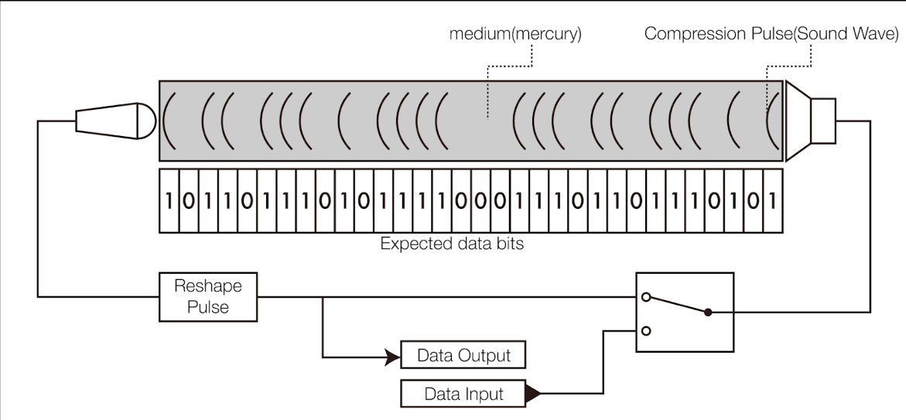
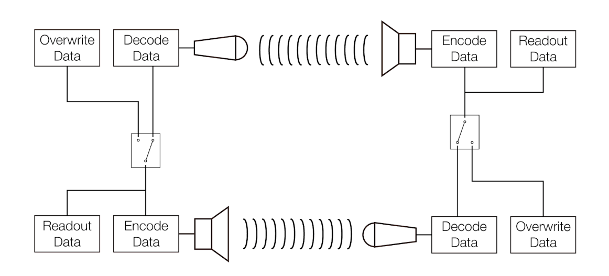

---

[Nominated for 23rd Campus Genius Award(Art Section).](/info/23rdcampusgeniusnominate)

---

2017/2/10~2/12 At Tokyo University of the Arts Senju Campus

Exhibited at Tokyo University of the Arts Graduation Exhibition(Music Creation and the Environments) 2017

- Thanks to Kuroishi Sayako, Masuda Yoshiki, Tsuji Yurika and more

<iframe src="https://player.vimeo.com/video/210539692?color=ffffff" style="position:absolute;left:0;top:0; width:100%; height:100%;" frameborder="0" webkitallowfullscreen mozallowfullscreen allowfullscreen></iframe>

Acoustic Delay line memory is the memory apparatus used with early electronic computer in 1950s.

Acoustic delay line memory is the system that detect pulse from speaker with microphone, and transmit that pulse to speaker again. Pulses start to circulate with certain pattern, so it works as digital memory system.

This works is the more over-interpreted acoustic delay memory system than past works [《Acoustic Delay (⇔) Memory》](/works/acoustic-delay-memory).

In this works, two type of a pair of system which has a function, "Listen, decode a data, re-encode same data and read out it".

The individual machines have a function of communication system but whole system have memory system. In this situation, where the data is stored in?

One type of a pair is using sound pulse like a original acoustic delay memory. Another one is using speech-to-text engine and text-to-spech engine.

Rethinking "Record" and "Memorise" through makeing sounds.

---

---
# Document 1

Acoustic Delay line memory is the memory apparatus used with early electronic computer in 1950s.
Utilizing the fact that sounds take certain time in propagation, if received data is returned back to transmitter, unless communication fail,completely same data will continue circulating. So It works as memory apparatus. John Presper Eckert, developer of this machine, explain that function as follows.

*John: The idea is if you had a mercury tank, let's say you can put 1,000 pulses into one end of the mercury tank before any starts spilling out of the other, this is a memory, but the trouble is, after, say, a millisecond, if the pulses are going in at one every microsecond, it's gone. But supposing I take the pulses coming out and reshape it and put it in every time. Now the thing will sit there and recirculate, as the saying goes.*

*Interviewer: So the storage is storing by motion of the mercury?*

*John: It's stored by a wave going through the mercury. The mercury's standing still, but a compression wave is going through it. Particle motion is occurring back and forth, and a wave is transmitting through it. How did I think of this idea? I remembered that when I was a little boy, when I went to the store, my mother would tell me, "I want you to get these four or five things." Rather than write them down, I did as other little boys probably did when their mother sent them to the store, I repeated these five things to myself over and over again all the way to the store. In this way, my short-term memory at a young age was turned into a long-term memory to get to the store. That's the same principle. It's taking this stuff out of the mercury tank and recirculating it through a recirculating path. We built the first UNIVACs with that type of memory, the UNIVAC I.*

This metaphor is not so suitable. This phenomenon is similar to rather the phenomenon "Screen burn-in" of CRT Display TV. It means some physical or chemical changes are happens and fixed by repeating some small phenomenon.

---

---
# Document 2

## Experiment 1

Hyposethis: The acoustic delay line memory may work with not only one pair of a speaker and a microphone but two or more pairs.
If it is constructed with over two pairs, the apparatuses are physically and completely split.
Each of machines works as only communication system, decodes a data from the microphone signal, re-encode the data and output it to the speaker.
In theory, it can be constructed without a physical memory.

In case of split composition, microphone will hear the mixed signal of it from its own speaker and it from paird machine's speaker.
But if signal was modulated to different frequency like a channel of radio, each of machines can decode data correctly.
In this works, quadrature amplitude modulation method which is used in wireless LAN communication is used.

Result: The purpose was mostly accomplished. In this experiment, I made 64bit storage with a 16QAM modulation method. For rapid prototyping, I implemented all signal processings on the software. So actually, there is latency with read and write process of a buffer memory to sampling audio signal. That buffer memory is needed at least 1024bit. So if I need to build a memory system easily, it is apparently better to use this buffer memory directly.
However, I felt something wrong. I wasn't aware of that physical memory with over 1024bit capacity during operation of 64bit acoustic memory.
That physical memory's function is only receive sampled data, retain temporarily, send to software and receive again.
Borrowing Eckert's explanation, it is like a situation that given another new shopping list in the middle of memorization. This is like that called  short term memory, different from a usual image of "memory".
Though, this buffer memory and a memory used in the computers to memory some information is identical.
In summary, mechanism of system is not important but usage is.

## Experiment 2

Hypothesis: The acoustic delay memory made in experiment 1 can be constructed without a physical memory in theory. However, if we can't regard memory system as is depending on the usage, Can we build "Something like acoustic delay memory" without consiousness either physical memory is used or not.
So something used as memory system usually can be transparent as function and something not used as memory will behave as memory. The least needed function is "receive, decode a data, re-encode and return it".
It can be constructed with a pair of speech-to-text engine and text-to-speech engine.

Result:When some text is generated and placed on the Google Docs by speech recognition engine, Google Docs (or physical memory on the computer storing that data) was apparently working as "memory system".
Is the length of time retaining data producing "memoriness(feeling like memory)"?

---

---

# Photos

